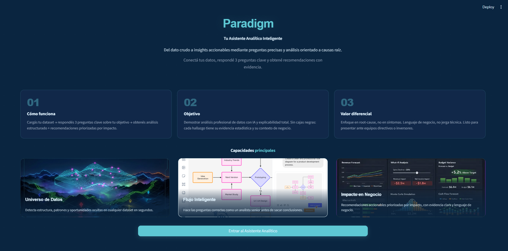
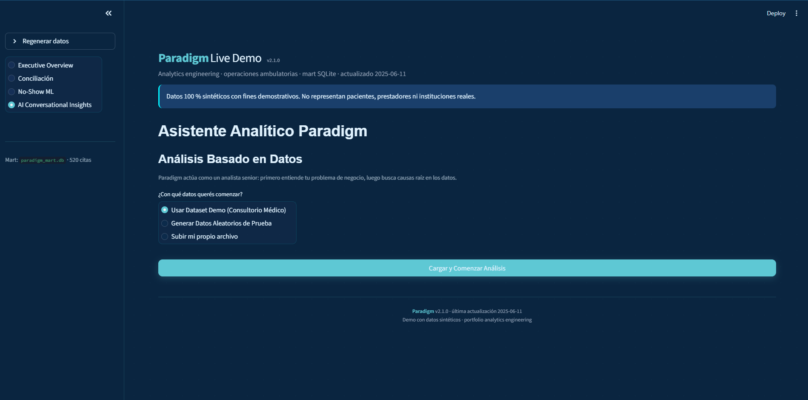
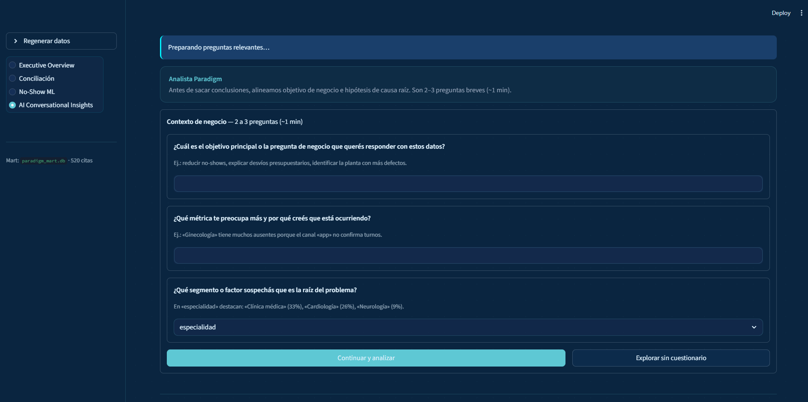
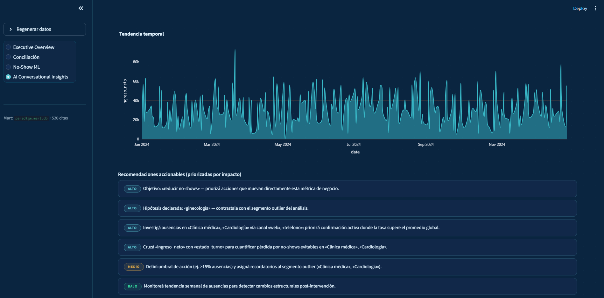
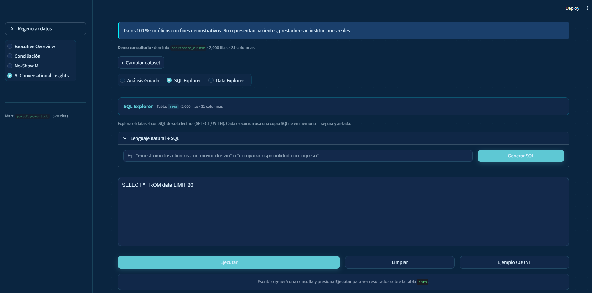
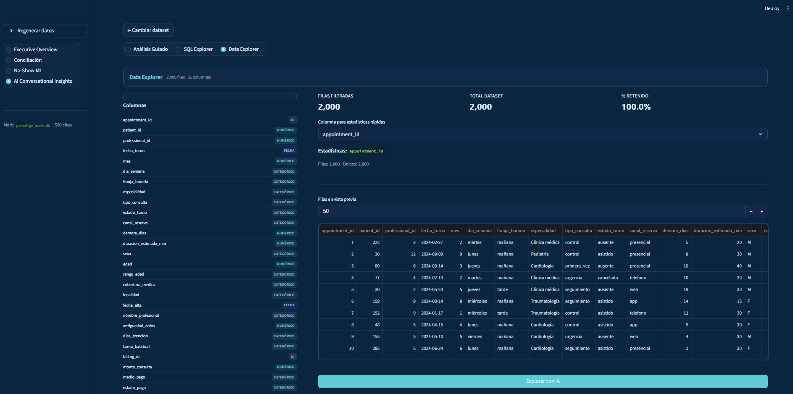
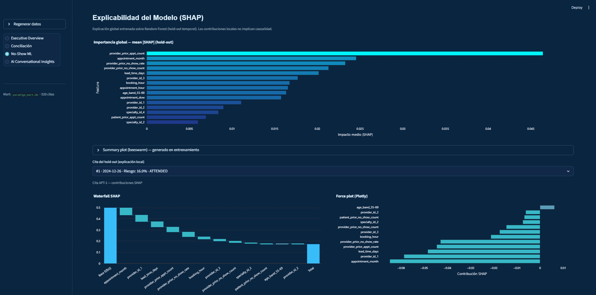
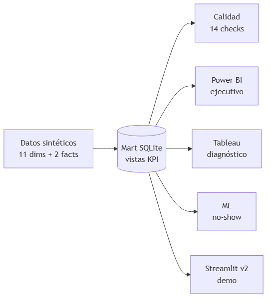
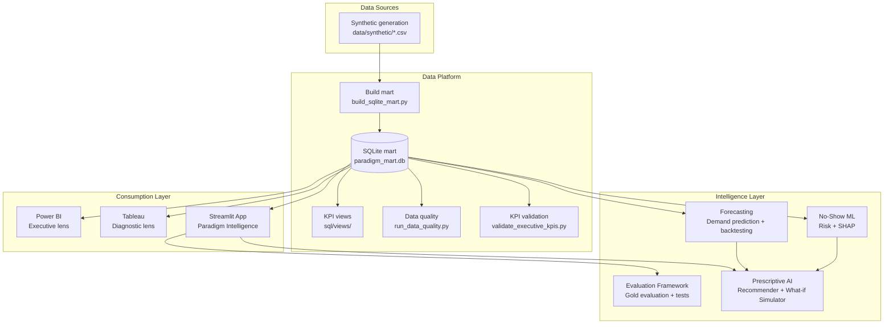

<div align="center">

# Paradigm

### Analytics engineering de punta a punta — del dato gobernado al insight accionable

**Portfolio profesional:** mart SQLite, KPIs validados, BI dual-lens, ML con SHAP y una demo Streamlit premium con analista conversacional, SQL Explorer y Data Explorer inmersivo.**

*Synthetic outpatient ops · reproducible pipeline · portfolio-ready · v2.1*

[](https://www.python.org/)
[](#live-demo)
[](https://pandas.pydata.org/)
[](ml/README.md)
[](sql/README.md)
[](#how-to-run)
[](ml/README.md)
[](LICENSE)

[Características](#características-principales) · [Demo Visual](#demo-visual) · [Ejecutar](#cómo-ejecutar) · [Por qué](#por-qué-este-proyecto) · [Architecture](#architecture)

</div>

---

> **Disclaimer:** Datos **100 % sintéticos** — demostración y portfolio únicamente. No representa pacientes, prestadores ni resultados operativos reales.

---

## Características Principales

**Paradigm Intelligence** posiciona una narrativa integrada de **Analytics Engineering + Data Science + Prescriptive AI**.

Después de Fases 1-4, el proyecto ya no se limita a reporting: combina capa gobernada de datos, predicción de demanda, evaluación técnica y simulación prescriptiva orientada a decisiones.

| Capa | Qué incluye |
|------|-------------|
| **Analytics Engineering Core** | Datos sintéticos reproducibles, mart SQLite gobernado, 14 checks de calidad, exports BI (Power BI + Tableau) |
| **Executive Intelligence** | KPIs trazables, conciliación atención-facturación, vistas operativas y recorrido analítico guiado |
| **Data Science (Predictive)** | No-Show ML con split temporal, SHAP global/local, simulación de impacto de negocio |
| **Forecasting Layer** | Forecast de demanda diaria por modelo/segmento, backtesting temporal y tracking de experimentos |
| **Evaluation Framework** | Evaluación conversacional sobre gold set, métricas comparables, reportes auditables y tests automáticos |
| **Prescriptive AI + What-if** | Recomendaciones por riesgo, selección de intervenciones, simulación Monte Carlo y export ejecutivo (CSV/MD/ZIP) |

En conjunto, Paradigm demuestra el ciclo completo: **describir → predecir → evaluar → prescribir**.

### Landing premium

Hero glassmorphism, gate inmersivo y tema dark profesional antes de entrar al asistente.



### Selección de dataset

Demo consultorio, datos sintéticos por dominio (salud, finanzas, operaciones) o upload CSV/Excel.



### Wizard root-cause

2–3 preguntas de negocio orientadas a causa raíz; motor determinístico (sin LLM).



### Análisis Guiado

Hallazgos, gráficos Plotly, recomendaciones por impacto y **exportación de informe Markdown**.



### SQL Explorer

NL→SQL heurístico, editor SQLite en memoria, resultados tabulares y gráfico automático.



### Data Explorer

Filtros dinámicos por tipo de columna, preview, estadísticas y puente «Explorar con IA».



### No-Show ML + SHAP

Simulación de riesgo, explicabilidad local/global e impacto de negocio (priorización, no predicción clínica).



Documentación del flujo conversacional: [`docs/conversational_insights_flow.md`](docs/conversational_insights_flow.md)

---

## Demo Visual

Galería rápida de la experiencia interactiva (capturas reales de `streamlit run streamlit_app.py`):

| Vista | Captura |
|-------|---------|
| Landing |  |
| Dataset |  |
| Wizard |  |
| Análisis |  |
| SQL |  |
| Explorer |  |
| No-Show SHAP |  |

**Power BI ejecutivo** (evidencia BI del portfolio):


**Arquitectura del pipeline:**



---

## Cómo ejecutar

### Opción recomendada (Make)

```bash
make install    # dependencias (una vez)
make all        # pipeline completo: sintético → mart → quality → exports
make demo       # levanta Streamlit en http://localhost:8501
```

### Opción completa (Fases 1-4)

```bash
make install           # dependencias base
make install-app       # dependencias app Streamlit
make all               # datos + mart + calidad + BI + no-show ML
make train-forecast    # forecasting de demanda
make eval-gold         # evaluación sobre gold set conversacional
make test-evaluation   # tests del evaluation framework
make run-app           # alias de demo
```

### Pipeline extendido en un paso

```bash
make build-all         # all + forecast + eval-gold + test-evaluation
```

### Manual

```bash
pip install -r requirements-app.txt
python scripts/build_sqlite_mart.py
python scripts/train_no_show.py              # no-show prediction + SHAP
python scripts/train_forecast.py             # forecasting layer (opcional recomendado)
python scripts/run_evaluation_test.py        # evaluation framework (gold report)
python -m unittest tests/test_evaluation.py  # tests de evaluación
streamlit run streamlit_app.py
```

### Docker

```bash
docker build -t paradigm-demo .
docker run -p 8501:8501 paradigm-demo
```

### AI Analyst — setup LLM (opcional)

El analista conversacional soporta **Ollama local** (default) o APIs cloud (Groq, OpenAI, Grok). Sin LLM configurado, la demo sigue funcionando con el motor heurístico determinístico.

**Ollama (recomendado para entrevistas offline):**

```bash
# 1. Instalar Ollama — https://ollama.com
ollama pull llama3.2
ollama pull nomic-embed-text   # embeddings para RAG (Fase 2)

# 2. Configuración opcional
cp .env.example .env           # Linux/macOS — en Windows: copy .env.example .env

# 3. Levantar la demo
pip install -r requirements-app.txt
streamlit run streamlit_app.py
```

**APIs cloud** — copiá `.env.example` a `.env` y ajustá el proveedor:

| Proveedor | `PARADIGM_LLM_PROVIDER` | Variable de API | Modelo sugerido |
|-----------|-------------------------|-----------------|-----------------|
| Groq | `groq` | `GROQ_API_KEY` | `llama-3.3-70b-versatile` |
| OpenAI | `openai` | `OPENAI_API_KEY` | `gpt-4o-mini` |
| Grok (xAI) | `grok` | `GROK_API_KEY` | `grok-2-latest` |

Grok usa API compatible OpenAI; `GROK_BASE_URL` default: `https://api.x.ai/v1`.

**Sin LLM:** `PARADIGM_LLM_PROVIDER=disabled` — solo heurísticas (comportamiento original).

### Características avanzadas del AI Analyst

| Feature | Descripción |
|---------|-------------|
| **RAG FAISS** | Retrieval sobre diccionario de datos, métricas y 5 SQL samples de referencia |
| **Chat persistente** | Botón **✦ Ask AI Analyst** en las 3 pestañas del workspace |
| **Insights estructurados** | JSON con insight, recomendación, impacto, confianza y fuentes citadas |
| **NL→SQL híbrido** | LLM + comparación con motor heurístico y validación `SELECT`/`WITH` |
| **Logging auditable** | `data/processed/llm_interactions.jsonl` — query, respuesta, latencia, tokens ~ |
| **Rate limiting** | `PARADIGM_LLM_RATE_LIMIT=10` consultas LLM por minuto (configurable) |
| **Transparencia UI** | Sidebar → **Ver Historial AI** o `PARADIGM_DEBUG=true` |
| **Tests** | `python -m unittest tests/test_llm_integration.py` |

Flujo detallado: [`docs/conversational_insights_flow.md`](docs/conversational_insights_flow.md)

> **Docker:** el contenedor no incluye Ollama. Para LLM en Docker usá un proveedor cloud o apuntá `OLLAMA_BASE_URL` al host (`http://host.docker.internal:11434` en Windows/macOS).

**Recorrido sugerido en la app:** Landing → **Entrar al Asistente Analítico** → cargar dataset → wizard → pestañas **Análisis Guiado · SQL Explorer · Data Explorer** → sidebar **No-Show ML** para SHAP + **Prescriptive AI What-if Simulator**.

> En Windows, `make` requiere [GNU Make](https://www.gnu.org/software/make/) (Git Bash, WSL o `choco install make`).

---

## Por qué este proyecto

Paradigm Intelligence muestra una evolución concreta desde analytics tradicional hacia una práctica híbrida de datos y AI.

Paradigm Intelligence demonstrates a practical progression from traditional analytics toward a hybrid data + AI practice.

1. **Analytics Engineering sólido** — modelo dimensional, métricas gobernadas, calidad auditable y trazabilidad end-to-end.
2. **Data Science aplicada al negocio** — No-Show ML interpretable (SHAP) + forecasting con backtesting temporal.
3. **AI evaluation by design** — framework de evaluación conversacional sobre gold set con métricas comparables y tests.
4. **Prescriptive AI accionable** — recomendaciones priorizadas + simulador what-if con impacto esperado en slots y revenue.
5. **Packaging profesional de portfolio** — Streamlit productizado, exportes ejecutivos (CSV/MD/ZIP), Make targets y Docker.

Ideal para roles híbridos como **Analytics Engineer with AI focus**, **Applied Data Scientist** o **Data Scientist en healthtech** que necesiten demostrar pensamiento de producto, rigor técnico y orientación a decisión.

Strong fit for hybrid roles where business impact matters: **Analytics Engineer with AI focus**, **Applied Data Scientist**, and **Healthtech Data Scientist** profiles.

---

## Paradigm Intelligence — Analytics Engineering + Data Science + Prescriptive AI Portfolio

**Caso de estudio completo para operaciones ambulatorias** — del dato sintético gobernado a decisiones accionables con predicción, evaluación y simulación prescriptiva.

### Números clave (datos sintéticos)

| Métrica | Valor |
|---------|------:|
| Citas totales | 520 |
| Tasa de asistencia | 70.8% |
| Tasa de no-show | 13.0% |
| Tasa de cancelación | 18.7% |
| Ingreso facturado | ~6.9 M ARS |
| Brecha atención-facturación | 31 citas |

*Detalle de arquitectura, capas y ML más abajo.*

---

## Table of Contents

| | |
|---|---|
| [About](#about) · [Sobre el Proyecto](#sobre-el-proyecto) | [Business Problem & Solution](#business-problem--solution) |
| [Key Results](#key-results) | [Architecture](#architecture) |
| [Tech Stack](#tech-stack) | [Project Layers](#project-layers) |
| [Live Demo](#live-demo) | [How to Run](#how-to-run) |
| [ML Experiment](#ml-experiment) | [Limitations](#limitations) · [Próximos pasos / Roadmap](#próximos-pasos--roadmap) · [Footer](#footer) |

---

## About

**Paradigm Intelligence** is an end-to-end case study for outpatient operations that combines **analytics engineering, data science, and prescriptive AI**. It demonstrates how to move from raw (synthetic) data to a governed SQLite mart, validated KPIs, demand forecasting, conversational evaluation, and actionable what-if simulation.

The focus is **analytical reliability**: governed metric definitions, automated quality checks, SQL contracts, and auditable outputs — not charts as an end in themselves.

Deep dives: [`docs/architecture.md`](docs/architecture.md) · [`docs/portfolio.md`](docs/portfolio.md)

---

## Sobre el Proyecto

**Paradigm Intelligence** es un caso de estudio end-to-end que integra **analytics engineering + data science + prescriptive AI** para operaciones ambulatorias: dato sintético → mart SQLite gobernado → KPIs validados → forecasting + evaluación → simulación what-if.

El foco es **confiabilidad analítica** — definiciones gobernadas, calidad automatizada y evidencia auditable — no gráficos aislados.

---

## Business Problem & Solution

### The problem

Outpatient centers lose efficiency and revenue through **no-shows**, **late cancellations**, **schedule gaps**, and **misalignment between care delivered and billing**. When dashboards are built without **governed KPI definitions** and a **traceable dimensional model**, the same metric can be calculated differently across teams — and historical charts alone do not say **what to fix first**.

### La solución · The solution

| Layer | Deliverable |
|-------|-------------|
| **Data** | Dimensional synthetic dataset (CSV) with explicit grain and keys |
| **Pipeline** | Reproducible Python sequence: generate → mart → quality → export |
| **Mart** | Local **SQLite** database with DDL and **KPI-oriented SQL views** |
| **Quality** | Automated checks with auditable Markdown report |
| **Governance** | Executive KPI validation against the mart |
| **BI** | CSV exports + documented patterns for **Power BI** (executive) and **Tableau** (diagnostic) |
| **AI/ML** | No-show prediction + forecasting + evaluation framework + prescriptive what-if (methodology-first, portfolio scope) |

**El problema (resumen):** no-shows, cancelaciones tardías, huecos de agenda y desalineación atención–facturación. Sin KPIs gobernados y modelo dimensional trazable, cada equipo calcula distinto y los tableros no priorizan acciones.

---

## Key Results

Reference numbers from the full mart (`python scripts/validate_executive_kpis.py`), aligned to the executive dashboard. Formal definitions: [`docs/metrics.md`](docs/metrics.md)

| Metric | Value | Context | Business Impact |
|--------|------:|---------|-----------------|
| **Total appointments** | **520** | Jan 2024 – Feb 2025 | Full-period operational baseline |
| **Attended** | **368** | 70.8% of agenda volume | Capacity actually utilized |
| **No-show rate** | **13.0%** | 55 no-shows · denom.: attended + no-show | Recoverable slots & revenue risk |
| **Cancellation rate** | **18.7%** | 97 cancelled appointments | Rebooking opportunity & planning noise |
| **Billed revenue** | **6,904,253 ARS** | Non-`VOID` billing lines (~$6.9 M) | Revenue recognized in the mart |
| **Billing gap** | **31** | Attended without billing line | Reconciliation & leakage control |
| **Dimensional model** | **11 dims + 2 facts** | 6 specialties · 8 providers | Governed star schema for BI & ML |
| **SQL contract** | **5 views** | Daily, specialty, provider, revenue bridge | Single source of truth for KPIs |
| **Data quality** | **14 checks** | 13 OK · 1 expected WARN (billing gap) | Auditable trust before consumption |

| Indicador | Valor | Impacto |
|-----------|------:|---------|
| Citas totales | 520 | Línea base del período |
| Tasa no-show | 13,0 % | Slots y revenue recuperables |
| Ingreso facturado | ~6,9 M ARS | Revenue reconocido |
| Brecha operativa | 31 citas | Conciliación atención–facturación |

---

## Architecture

A governed foundation now powers predictive, evaluative, and prescriptive layers in one consistent architecture.



### Architecture summary (ES/EN)

- **Fase 1-2 / Data + BI:** base gobernada y reproducible para análisis confiable; governed and reproducible foundation for reliable analytics.
- **Fase 3 / Predictive + Evaluation:** no-show prediction, forecasting y evaluación técnica trazable; predictive models plus measurable evaluation quality.
- **Fase 4 / Prescriptive:** recomendaciones accionables y simulación what-if con export ejecutivo; action-oriented guidance with scenario-based impact simulation.

Full model, analytic lenses, and implementation: [`docs/architecture.md`](docs/architecture.md)

---

## Tech Stack

| Area | Tools | Purpose (EN) | Propósito (ES) |
|------|-------|--------------|----------------|
| **Language** | Python 3.10+ | Pipeline orchestration | Orquestación del pipeline |
| **Data** | pandas · numpy · CSV | Synthetic dimensional datasets | Datasets sintéticos dimensionales |
| **Storage** | SQLite | Local analytic mart | Mart analítico local |
| **SQL contract** | DDL + 5 KPI views + 5 samples | Governed metric layer | Capa de métricas gobernadas |
| **Quality** | `paradigm.quality` (14 rules) | Automated mart validation | Validación automatizada del mart |
| **BI** | Power BI · Tableau Desktop | CSV consumption (no binaries in Git) | Consumo vía CSV export |
| **ML** | scikit-learn · joblib | Temporal split, ranking metrics | Split temporal, métricas de ranking |
| **Streamlit v2** | Streamlit · Plotly · mart SQLite | Live Demo — KPIs, conciliación, ML sim | Demo interactivo principal del portfolio |
| **Legacy app** | Streamlit · Plotly (v1) | Optional CSV explorer | Explorador interactivo opcional (v1) |
| **Docs** | Markdown · Mermaid | Regenerable reports & diagrams | Reportes y diagramas regenerables |

*Local reproducibility by design; optional Docker setup for the Live Demo — see [How to Run](#how-to-run).*

---

## Project Layers

| Layer | Description | Enlace |
|-------|-------------|--------|
| **Data** | Synthetic CSVs, fact grain, dimensions | [`data/README.md`](data/README.md) · [`data/synthetic/README.md`](data/synthetic/README.md) |
| **SQL** | DDL, KPI views, business queries | [`sql/README.md`](sql/README.md) |
| **Python** | Pipeline, quality, I/O, ML module | [`python/README.md`](python/README.md) |
| **BI — Power BI** | CSV export, DAX measures, build guide | [`bi/powerbi/README.md`](bi/powerbi/README.md) |
| **BI — Tableau** | CSV export, exploratory patterns | [`bi/tableau/README.md`](bi/tableau/README.md) |
| **ML** | Experiment framing, features, honest evaluation | [`ml/README.md`](ml/README.md) |
| **Docs** | Metrics, dictionary, analytical questions, portfolio | [`docs/metrics.md`](docs/metrics.md) · [`docs/data_dictionary.md`](docs/data_dictionary.md) · [`docs/portfolio.md`](docs/portfolio.md) |
| **Legacy** | Paradigm v1 — Streamlit + sample data | [`legacy/README.md`](legacy/README.md) |

### Repository structure

```
Paradigm/
├── assets/              # Dashboard screenshots & diagrams
├── bi/                  # Power BI and Tableau — exports and notes
├── data/
│   ├── synthetic/       # Dimensional CSVs (regenerable)
│   └── processed/       # paradigm_mart.db (generated locally)
├── docs/                # Architecture, metrics, dictionary, portfolio
├── app/                 # Streamlit v2 Live Demo modules
├── streamlit_app.py     # Entry point — streamlit run streamlit_app.py
├── legacy/              # Paradigm v1 — Streamlit + sample clinic data
├── ml/                  # Experiment README and artifacts
├── python/src/paradigm/ # Quality, I/O, and ML module
├── reports/             # quality_report.md (regenerable evidence)
├── scripts/             # Pipeline entrypoints
└── sql/                 # DDL, views, and sample queries
```

---

## Live Demo

### Interactive demo (Streamlit v2) — recommended

App principal del portfolio: KPIs ejecutivos, conciliación atención–facturación y simulación de no-show conectados al mart SQLite.

```bash
pip install -r requirements-app.txt
python scripts/build_sqlite_mart.py          # si no existe data/processed/paradigm_mart.db
python scripts/train_no_show.py              # opcional — tab No-Show ML
streamlit run streamlit_app.py
```

Abre `http://localhost:8501`. Filtros en sidebar (fecha, especialidad, proveedor, canal). Botón **Regenerar datos** disponible en el sidebar (requiere confirmación).

| Sección | Contenido |
|---------|-----------|
| **Executive Overview** | 6 KPIs, tendencia temporal, breakdown por especialidad, card de brecha |
| **Conciliación** | ATTENDED_NO_BILLING, comparativa atención vs facturación |
| **No-Show ML** | Formulario de simulación + probabilidad y recomendación |
| **AI Conversational Insights** | Wizard + análisis contextual, **SQL Explorer** (NL→SQL, SQLite en memoria), **Data Explorer** (filtros + subset IA) ([flujo](docs/conversational_insights_flow.md)) |

---

**Power BI** executive view — full-period synthetic snapshot for portfolio evidence:


| Lens | Role | Status |
|------|------|--------|
| **Streamlit v2** | Live Demo interactivo — mart + ML | `streamlit run streamlit_app.py` |
| **Power BI** | Executive monitoring — "what happened" | CSV exports, DAX snippets, build instructions in [`bi/powerbi/`](bi/powerbi/README.md) |
| **Tableau** | Diagnostic exploration — "where to dig" | CSV exports and patterns in [`bi/tableau/`](bi/tableau/README.md) |
| **Streamlit (legacy v1)** | Optional CSV explorer | `streamlit run legacy/app/main.py` — see [How to Run](#how-to-run) |

**Suggested demo order:** Streamlit v2 → Executive (Power BI) → Diagnostic (Tableau) → Quality report → ML methodology. Details: [`docs/portfolio.md`](docs/portfolio.md)

No `.pbix` / `.twbx` binaries are versioned — evidence via CSV, docs, and screenshots.

---

## How to Run

**Requirements:** Python 3.10+ (local) · Docker + Docker Compose v2 (container) · GNU Make (optional, for advanced local workflows)

### Make (recommended for local pipeline)

```bash
make install        # pipeline dependencies (requirements.txt)
make install-app    # Streamlit app dependencies (requirements-app.txt)
make all            # synthetic → mart → quality → BI exports → no-show ML
make train-forecast # demand forecasting layer
make eval-gold      # conversational evaluation over gold set
make test-evaluation # evaluation framework tests
make run-app        # Streamlit v2 Live Demo at http://localhost:8501
```

| Target | Purpose |
|--------|---------|
| `make all` | Core pipeline (data, mart, quality, BI, no-show ML) |
| `make train-forecast` | Train demand forecasting models and register experiments |
| `make eval-gold` | Generate evaluation report from conversational gold dataset |
| `make test-evaluation` | Execute evaluation unit tests |
| `make build-all` | End-to-end phases 1-4 in one command |
| `make run-app` | Launch Streamlit app (alias of demo) |
| `make help` | List all available targets |

On Windows without Make, use the manual script sequence below or install GNU Make via Chocolatey, Git Bash, or WSL.

---

### Docker (recommended for quick demo)

Runs the Streamlit v2 Live Demo without a local Python venv. Persistent data lives on the host via mounted volumes.

**Prerequisites:** [Docker](https://docs.docker.com/get-docker/) and Docker Compose v2.

**First run** — generate synthetic CSVs, build the SQLite mart, and train ML models:

```bash
docker compose --profile init run --rm db
```

**Start the app:**

```bash
docker compose up --build
```

Open `http://localhost:8501`.

| Command | Purpose |
|---------|---------|
| `docker compose up -d` | Run in background |
| `docker compose down` | Stop containers |
| `docker compose exec app python scripts/build_sqlite_mart.py` | Rebuild mart manually |
| `docker compose --profile init run --rm db` | Full regenerate (CSV → mart → ML) |

**Volumes:** `./data/processed` (SQLite mart) and `./ml/experiments` (joblib models + metrics) are bind-mounted into the container. If you already have `data/processed/paradigm_mart.db` locally, it is used automatically. The init profile also writes regenerated CSVs to `./data/synthetic` on the host.

---

### 1. Environment setup (local)

```bash
python -m venv .venv
```

**Windows (PowerShell / CMD):**

```bash
.venv\Scripts\activate
pip install -r requirements.txt
```

**Linux / macOS:**

```bash
source .venv/bin/activate
pip install -r requirements.txt
```

### 2. Full pipeline (recommended order)

```bash
make all
```

Or step by step:

```bash
python scripts/generate_paradigm_v2_synthetic.py
python scripts/build_sqlite_mart.py
python scripts/run_data_quality.py
python scripts/export_powerbi_source.py
python scripts/export_tableau_source.py
python scripts/validate_executive_kpis.py
python scripts/train_no_show.py
python scripts/train_forecast.py
python scripts/run_evaluation_test.py
python -m unittest tests/test_evaluation.py
```

| Script | Main output | What it does |
|--------|---------------|--------------|
| `generate_paradigm_v2_synthetic.py` | `data/synthetic/*.csv` | Generates dimensional synthetic CSVs |
| `build_sqlite_mart.py` | `data/processed/paradigm_mart.db` | Builds SQLite mart (DDL + views) |
| `run_data_quality.py` | `reports/quality_report.md` | Runs 14 quality checks on the mart |
| `export_powerbi_source.py` | `bi/powerbi/source_csv/` | Exports CSVs for Power BI |
| `export_tableau_source.py` | `bi/tableau/source_csv/` | Exports CSVs for Tableau |
| `validate_executive_kpis.py` | Console reference totals | Validates executive KPIs against mart |
| `train_no_show.py` | `ml/experiments/metrics.json` | Trains no-show prioritization models |
| `train_forecast.py` | `ml/experiments/*forecast*` | Trains forecasting models + backtesting outputs |
| `run_evaluation_test.py` | `reports/evaluation_gold_report.json` | Runs conversational evaluation on gold data |
| `tests/test_evaluation.py` | Test output | Validates evaluation framework behavior |

### 3. Live Demo — Streamlit v2 (recommended)

```bash
make demo
```

Or manually:

```bash
pip install -r requirements-app.txt
python scripts/build_sqlite_mart.py
python scripts/train_no_show.py    # optional, for No-Show ML tab
python scripts/train_forecast.py   # optional, for Forecasting context
streamlit run streamlit_app.py
```

### 4. Optional — legacy v1 Streamlit explorer

```bash
pip install -r requirements-app.txt
streamlit run legacy/app/main.py
```

### 5. Optional — SQL sample queries

```bash
sqlite3 data/processed/paradigm_mart.db < sql/samples/01_no_show_by_specialty.sql
```

### Cómo ejecutar (resumen)

**Docker (recomendado para demo):** `docker compose --profile init run --rm db` → `docker compose up --build` → `http://localhost:8501`.

**Local (Make):** `make install` → `make install-app` → `make build-all` → `make run-app`.

**Local (manual):** `venv` → `pip install -r requirements.txt` → ejecutar pipeline + forecast + evaluación. Live Demo v2 con `make run-app` o `requirements-app.txt` + `streamlit run streamlit_app.py`.

---

## ML Experiment

Scoped **no-show prioritization** experiment on synthetic data: target definition, leakage prevention, temporal split, and ranking metrics — **not** a production-ready model.

| Aspect | Detail |
|--------|--------|
| **Problem** | Prioritize appointments by no-show risk at booking time |
| **Target** | `1` = NO_SHOW, `0` = ATTENDED; cancelled rows excluded |
| **Split** | Temporal by `appointment_date`; cutoff **2024-12-05**; 332 train / 91 test |
| **Models** | Logistic regression (baseline) · Random Forest (120 trees) |

**Honest metrics** (`ml/experiments/metrics.json`):

| Model | ROC-AUC | PR-AUC | Top-decile capture |
|-------|--------:|-------:|-------------------:|
| Logistic baseline | **0.41** | 0.11 | 9.1% |
| Random Forest | **0.42** | 0.11 | 9.1% |

ROC-AUC near **0.40–0.42** reflects **weak synthetic signal**, not a broken pipeline. The experiment demonstrates methodology, evaluation plumbing, and portfolio honesty.

**Improvement paths with real data:** richer patient histories, segment-specific features, calibration, production monitoring, and organizational validation.

Full detail: [`ml/README.md`](ml/README.md)

### Data model summary

- **`fact_appointment`** — One row per **appointment** (patient, provider, specialty, channel, status, dates).
- **`fact_billing_line`** — One row per **billing line** (amount, date, status).

Dimensions: calendar (`dim_date`), patients, providers, specialties, appointment status, booking channel, billing status, coverage, and cancellation reason.

Column-level documentation: [`docs/data_dictionary.md`](docs/data_dictionary.md)

---

## Limitations

- **Synthetic data only** — no clinical or commercial claims.
- **No production deployment** — local mart, scripts, and documented BI consumption.
- **No real patient data (PHI).**
- **No BI binaries in Git** — evidence via CSV, docs, and screenshots.
- **ML is methodology-first** — see [`ml/README.md`](ml/README.md) and `ml/experiments/metrics.json`.

- Solo datos sintéticos · sin despliegue productivo · sin PHI · ML orientado a metodología.

---

## UI/UX Premium

La demo interactiva usa un tema dark glassmorphism consistente en todas las vistas.

### Paleta de colores

| Token | Hex | Uso |
|---|---|---|
| `COLOR_PRIMARY` | `#00f5ff` | Cyan marca — acentos puntuales |
| `COLOR_PRIMARY_SOFT` | `#5ec8d4` | Cyan apagado — headers, métricas, CTAs |
| `COLOR_CHART` | `#38b8c7` | Series principales en gráficos |
| `COLOR_BG_MAIN` | `#0a2540` | Fondo principal (deep navy) |
| `COLOR_BG_CARD` | `#13294b` | Superficie de cards |
| `COLOR_TEXT` | `#e0f2fe` | Texto principal |
| `COLOR_BORDER` | `#5ec8d433` | Borde sutil |
| `COLOR_SUCCESS` | `#34d399` | Verde muted — éxito / impacto Bajo |
| `COLOR_WARNING` | `#d4a24a` | Ámbar muted — impacto Medio |

### Estructura de archivos UI

```
.streamlit/config.toml      ← tema Streamlit dark (base="dark")
assets/css/custom.css       ← CSS maestro (glassmorphism, badges, landing)
app/config/               ← tema (theme.py) + LLM (llm_config.py)
app/ui.py                   ← componentes: inject_theme, landing, KPI grid, wizard
app/plots.py                ← charts Plotly (template="plotly_dark")
app/conversational/plots.py ← charts contextuales (template="plotly_dark")
assets/landing/             ← imágenes hero de la landing page
```

### Landing page

Al abrir la app por primera vez se muestra una landing hero inmersiva:

- Título **Paradigm** en cyan con text-shadow glow.
- Subtítulo "Tu Asistente Analítico Inteligente".
- Tres feature cards con glassmorphism (Cómo funciona / Objetivo / Valor).
- Tres image cards con overlay degradado (assets/landing/).
- Botón CTA cyan "Entrar al Asistente Analítico".

El gate es `st.session_state["show_landing"]`; el botón lo pone en `False` y hace `st.rerun()`.

### Glassmorphism

Cards con `backdrop-filter: blur(12px)`, `background: rgba(19, 41, 75, 0.85)`,
borde `1px solid #00f5ff33`. Hover: borde cambia a `#00f5ff` + `box-shadow` cyan.

### Badges de impacto

Las recomendaciones del wizard usan badges coloreados inline:

| Badge | Color |
|---|---|
| Alto | Cyan muted `#5ec8d4` |
| Medio | Ámbar muted `#d4a24a` |
| Bajo | Verde muted `#34d399` |

---

## Próximos pasos / Roadmap

- **MLOps lite:** versionado de modelos y experimentos con comparación de runs y checklist de promoción; lightweight model lifecycle with run comparison and promotion criteria.
- **Serving de inferencia:** endpoint simple para scoring de no-show y recomendaciones prescriptivas online; simple inference endpoint for online scoring and recommendations.
- **Forecasting en producción:** refresco automático de series y alertas por desvío de demanda; automated refresh and drift-aware demand alerts.
- **Evaluación continua:** suite de regresión para AI Analyst en CI con benchmarks históricos; continuous evaluation in CI with historical baselines.
- **Observabilidad de impacto:** seguimiento de intervención vs resultado para recalibrar efectividad y retorno operativo; intervention-outcome observability to improve effectiveness and ROI.

---

## Footer

| | |
|---|---|
| **GitHub** | [Agus-Delgado](https://github.com/Agus-Delgado) |
| **LinkedIn** | [Agustín Delgado](https://www.linkedin.com/in/agustin-delgado-data98615190/) |
| **Portfolio guide** | [`docs/portfolio.md`](docs/portfolio.md) |
| **License** | [MIT License](LICENSE) |

<div align="center">

**Built with ❤️ for portfolio & interview preparation**

*Hecho con ❤️ para portfolio y preparación de entrevistas*

**Paradigm** — *clear definitions, reproducible pipeline, auditable evidence.*

*definiciones claras, pipeline reproducible, evidencia auditable.*

</div>
