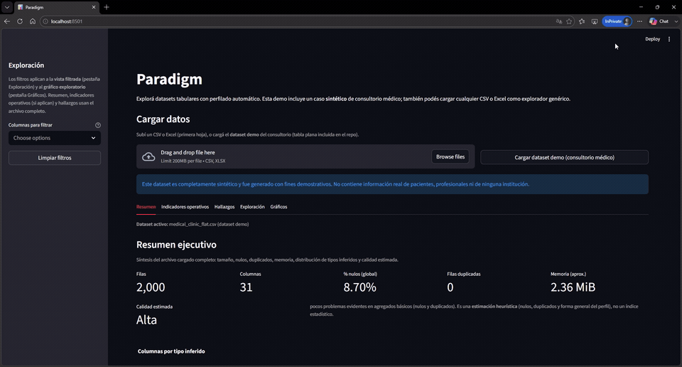
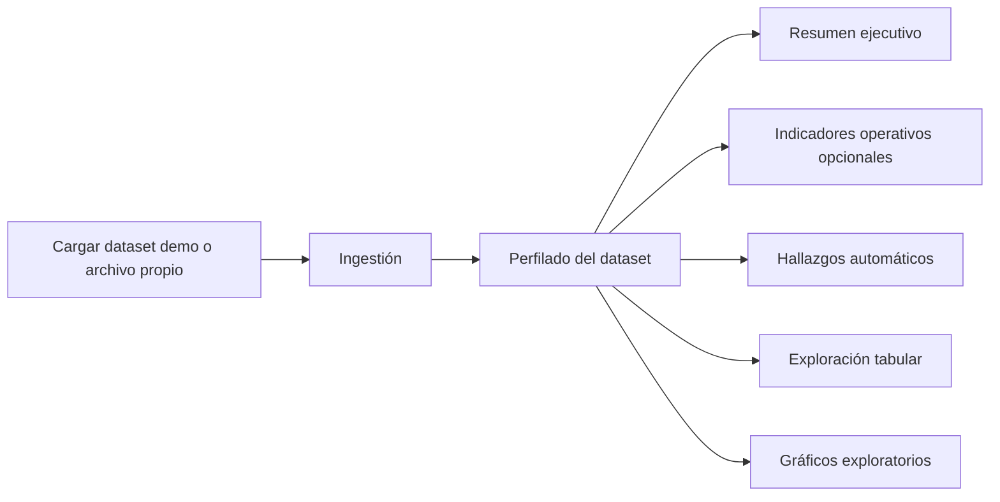

# Paradigm

Paradigm es una **demo analítica** para explorar y entender **datasets tabulares**. Combina carga de archivos, **perfilado automático**, **hallazgos**, **exploración interactiva** (filtros y vista tabular) y **visualizaciones** para ofrecer una lectura rápida del estado de los datos.

La versión actual incluye un **caso aplicado a un consultorio médico ambulatorio** (datos sintéticos), pensado como narrativa de portfolio cercana a un escenario operativo. El **motor del proyecto sigue siendo reutilizable**: podés analizar cualquier **CSV** o **XLSX** (primera hoja) sin depender del dominio salud.

---

## Vista previa / demo visual

Vista rápida del flujo principal: carga del dataset demo, análisis y exploración por pestañas.



---

## Caso de uso demo: consultorio médico

La demo principal usa un **dataset sintético** de consultorio para simular un entorno de **atención ambulatoria**. Sirve para mostrar cómo Paradigm apoya una lectura operativa del día a día:

- **Turnos** y volumen de actividad  
- **Asistencia**, ausentismo y **cancelaciones**  
- **Especialidades** y **coberturas médicas**  
- **Facturación** e **ingresos**  
- **Exploración rápida** de la tabla y métricas de calidad  

Es un ejemplo de cómo unificar **perfilado técnico** y **contexto de negocio** en una misma interfaz.

---

## Disclaimer — datos sintéticos

Los datos del caso médico son **completamente ficticios** y fueron **generados de forma sintética** solo para demostración. **No representan** pacientes, profesionales, instituciones ni operaciones reales. En la app, al cargar el dataset demo, se muestra un **banner** con la misma aclaración.

---

## Estado actual del proyecto

Paradigm está en **etapa de demo funcional** y **evolución continua**. La base actual permite recorrer el flujo principal del producto con claridad; decisiones técnicas y de experiencia de usuario seguirán refinándose a medida que el proyecto madure. El enfoque es **honesto y orientado a aprendizaje y portfolio**, sin pretender cubrir aún un producto enterprise completo.

---

## Motor genérico (más allá del caso médico)

El **caso del consultorio** es la **demo destacada**, no una limitación del producto. Con un archivo propio, Paradigm aplica el mismo pipeline de **ingestión**, **inferencia de tipos**, **resumen**, **hallazgos de calidad**, **filtros**, **tabla exploratoria** y **gráficos**. Los **indicadores operativos** y los **hallazgos operativos del consultorio** solo se activan cuando el esquema coincide con el del demo plano; el resto del comportamiento **no depende** del dominio médico.

---

## Funcionalidades principales

| Área | Qué incluye |
|------|-------------|
| **Carga** | Botón **«Cargar dataset demo (consultorio médico)»** o **upload** CSV/XLSX. |
| **Navegación** | **Pestañas**: Resumen, Indicadores operativos, Hallazgos, Exploración, Gráficos (menos scroll, recorrido ordenado). |
| **Resumen ejecutivo** | Métricas globales, calidad estimada, distribución de tipos inferidos y **perfil por columna** (expander). |
| **Perfilado** | Tipos lógicos (numérico, categórico, booleano, fecha/hora, texto, identificador); etiquetas en español en la UI. |
| **Indicadores operativos** | KPIs del consultorio **solo si** las columnas coinciden con el esquema del demo plano. |
| **Hallazgos** | **Operativos** (consultorio, si aplica) y **de calidad de datos** (reglas heurísticas sobre el perfil). |
| **Exploración** | Filtros en **barra lateral** (afectan vista tabular en **Exploración** y gráfico exploratorio en **Gráficos**). |
| **Gráficos** | Gráfico exploratorio sobre la vista filtrada y gráfico de **nulos por columna** sobre el dataset completo. |
| **Demo** | Banner de datos sintéticos al usar la carga demo. |

---

## Flujo de uso



Tras el perfilado, las áreas **D–H** se consultan por **pestañas** en la app; comparten la misma base analítica y, en exploración, los **filtros** del sidebar.

---

## Estructura del repositorio

```
Paradigm/
├── app/
│   ├── main.py                 # Interfaz Streamlit (tabs, carga, visualización)
│   ├── core/
│   │   ├── clinic_operational_insights.py   # Hallazgos operativos (consultorio, opcional)
│   │   ├── clinic_operational_kpis.py       # KPIs operativos (consultorio, opcional)
│   │   ├── exploration.py
│   │   ├── findings.py
│   │   ├── ingestion.py
│   │   ├── profiling.py
│   │   ├── schema.py
│   │   └── utils.py
│   └── visualization/
│       └── charts.py
├── data/
│   └── sample/
│       ├── medical_clinic/
│       │   ├── medical_clinic_flat.csv   # Tabla plana usada por el botón demo
│       │   ├── patients.csv
│       │   ├── professionals.csv
│       │   ├── appointments.csv
│       │   └── billing.csv
│       ├── ventas_ejemplo.csv
│       └── mixto.csv
├── docs/
│   └── images/                 # GIF principal del README y capturas adicionales (opcional)
├── scripts/
│   └── generate_medical_clinic_data.py   # Regenera el dataset sintético del consultorio
├── requirements.txt
└── README.md
```

---

## Instalación y ejecución

**Requisitos:** Python 3.10+

```powershell
cd ruta\a\Paradigm
python -m venv .venv
.\.venv\Scripts\Activate.ps1
pip install -r requirements.txt
```

Linux o macOS:

```bash
cd ruta/a/Paradigm
python3 -m venv .venv
source .venv/bin/activate
pip install -r requirements.txt
```

Desde la **raíz del repositorio**:

```bash
streamlit run app/main.py
```

Abre la URL que indique Streamlit (por defecto `http://localhost:8501`).

### Stack

- **Streamlit** — interfaz web  
- **Pandas** — datos tabulares  
- **Plotly** — gráficos interactivos  
- **openpyxl** — lectura de Excel (`.xlsx`)  
- **NumPy** — generación de datos en el script del consultorio  

---

## Cómo usar la demo

1. Ejecutá la app con `streamlit run app/main.py`.  
2. **Opción A:** pulsá **«Cargar dataset demo (consultorio médico)»** para cargar [`data/sample/medical_clinic/medical_clinic_flat.csv`](data/sample/medical_clinic/medical_clinic_flat.csv).  
3. **Opción B:** subí un **CSV** o **XLSX** propio para usar Paradigm como explorador genérico.  
4. Navegá las **pestañas** (Resumen → Indicadores → Hallazgos → Exploración → Gráficos) y, si querés filtrar, usá la **barra lateral** (impacta vista tabular y gráfico exploratorio).  

Si el archivo **no** coincide con el esquema del demo, seguirás viendo resumen, hallazgos de calidad, exploración y gráficos genéricos; los bloques **operativos del consultorio** no se mostrarán.

### Regenerar datos sintéticos del consultorio

Misma semilla → mismos archivos en `data/sample/medical_clinic/`:

```bash
python scripts/generate_medical_clinic_data.py
```

Convención de columnas del demo: **español**, `snake_case`; identificadores pueden usar sufijos `_id`.

---

## Roadmap y próximos pasos

- Refinar UX y presentación (textos de ayuda, capturas complementarias).  
- Ampliar pruebas con CSV de distintos dominios.  
- Valorar extensiones puntuales (exportar resumen, más reglas de hallazgos) sin perder el foco en demo clara.  

**Limitaciones actuales (esperables en esta etapa):** una sola hoja en Excel; inferencia heurística de tipos; datos en memoria local; sin base de datos, autenticación ni modelos de ML en esta versión.

---

## Nota final

Paradigm pretende crecer desde una **demo funcional** hacia una experiencia analítica **más sólida, clara y reutilizable**. Esta versión es una **base real de trabajo** sobre la que seguir iterando, con **transparencia** sobre el uso de datos ficticios y sobre el alcance del MVP.

---

## Licencia

**Licencia no especificada aún.** Podés definir una licencia abierta o restricciones al publicar el repositorio.

---

## Contacto / repositorio

Sustituí este apartado con el enlace al repositorio público o a tu perfil profesional cuando publiques el proyecto.
