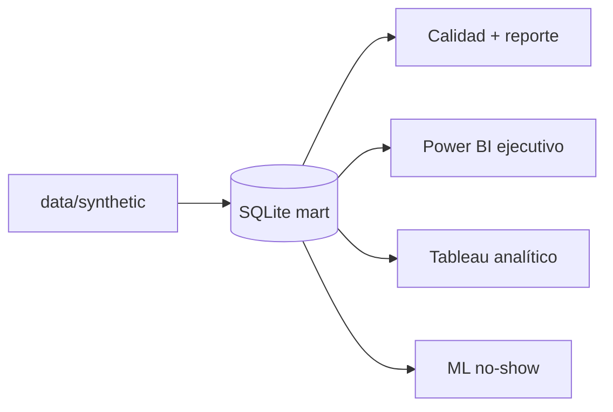

# Paradigm v2

**Plataforma analítica end-to-end (portfolio)** para operación ambulatoria: modelo dimensional en **SQL**, calidad reproducible en **Python**, **Power BI** (seguimiento ejecutivo), **Tableau** (análisis exploratorio) y **ML** acotado (riesgo de no-show). Los datos son **sintéticos** y ficticios; el foco es **gobernanza de métricas, reproducibilidad y narrativa defendible** en entrevistas.

---

## Resumen ejecutivo

Paradigm v2 muestra cómo pasar de **datos tabulares gobernados** a **KPIs auditables**, **visualización por rol** (ejecutivo vs analítico) y un **modelo de priorización** complementario, sin inflar alcance ni resultados. El repositorio incluye documentación de negocio, diccionario de métricas, mart **SQLite** local, reporte de calidad, exportes para BI, especificación Tableau y pipeline de entrenamiento ML documentado.

---

## Dashboard ejecutivo


Vista del tablero ejecutivo en Power BI (datos sintéticos): KPIs del periodo, tendencia operativa y lectura rápida para dirección, alineada a las definiciones del diccionario de métricas.

---

## Problema de negocio

Los centros ambulatorios pierden eficiencia e ingresos por huecos de agenda, **no-shows**, cancelaciones (en particular tardías) y **desalineación** entre atención y facturación. Sin definiciones explícitas de métricas y un modelo de datos trazable, los tableros son difíciles de auditar y comparar en el tiempo.

**Lectura ampliada:** [`docs/business_case.md`](docs/business_case.md).

---

## Arquitectura

Flujo lógico implementado:

```text
data/synthetic (CSV)  →  build SQLite mart  →  calidad Python  →  consumo (BI / ML)
```

- **Contrato analítico:** DDL y vistas en [`sql/`](sql/README.md); KPIs alineados a [`docs/metric_definitions.md`](docs/metric_definitions.md).
- **Verdad operativa local:** `data/processed/paradigm_mart.db` (generado; no versionado).
- **Consumo:** CSV desde el mart (`export_powerbi_source.py`, `export_tableau_source.py`) o cliente SQL; ML lee el mismo mart.

**Detalle:** [`docs/architecture.md`](docs/architecture.md).



---

## Stack y rol de cada herramienta

| Capa | Herramienta | Rol en Paradigm v2 |
|------|-------------|-------------------|
| Datos | CSV sintéticos + SQLite | Fuente única para BI y ML; portable para portfolio |
| SQL | DDL + vistas `vw_*` | Contrato de KPIs, muestras en `sql/samples/` |
| Python | `paradigm` (calidad, ML) | `run_data_quality.py`, exports BI, `train_no_show.py` |
| Power BI | Desktop (diseño documentado) | **Una página ejecutiva** — KPIs del periodo; CSV + DAX + instrucciones en `bi/powerbi/` |
| Tableau | Desktop (diseño documentado) | **Exploración y causa** — mismos datos, otra narrativa; `bi/tableau/` |
| ML | scikit-learn | Baseline + Random Forest para **riesgo de no-show**; métricas en `ml/experiments/metrics.json` (el desempeño en datos sintéticos puede ser débil; vale la **metodología**) |

---

## Modelo de datos y KPIs (resumen)

- **Hechos:** `fact_appointment` (grano cita), `fact_billing_line` (grano línea de cargo).
- **KPIs clave (MVP):** no-show y cancelación (con anclajes temporales definidos), citas atendidas, ingreso facturado (`billing_date`), conciliación atención–facturación; ocupación como **proxy** documentada donde aplique.

**Fuente normativa:** [`docs/metric_definitions.md`](docs/metric_definitions.md) y [`docs/data_dictionary.md`](docs/data_dictionary.md).

---

## Datos sintéticos y disclaimer

Todos los identificadores y hechos son **ficticios** y fueron generados para demostración. **No representan** pacientes, profesionales ni instituciones reales. Cualquier lectura “de negocio” es **ilustrativa**; el valor del proyecto está en el **diseño analítico** y la **reproducibilidad**.

---

## Flujo reproducible (desde la raíz del repo)

**Requisitos:** Python 3.10+

```bash
python -m venv .venv
# Windows: .venv\Scripts\activate  |  Linux/macOS: source .venv/bin/activate
pip install -r requirements.txt
```

**Pipeline analítico v2:**

```bash
python scripts/generate_paradigm_v2_synthetic.py
python scripts/build_sqlite_mart.py
python scripts/run_data_quality.py
python scripts/export_powerbi_source.py
python scripts/export_tableau_source.py
python scripts/validate_executive_kpis.py
python scripts/train_no_show.py
```

| Paso | Salida relevante |
|------|-------------------|
| Sintético | `data/synthetic/*.csv` |
| Mart | `data/processed/paradigm_mart.db` |
| Calidad | [`reports/quality_report.md`](reports/quality_report.md) |
| Power BI | `bi/powerbi/source_csv/` |
| Tableau | `bi/tableau/source_csv/` |
| ML | `ml/experiments/metrics.json`, modelos `.joblib` |

**Referencias:** [`sql/README.md`](sql/README.md), [`python/README.md`](python/README.md), [`bi/powerbi/README.md`](bi/powerbi/README.md), [`bi/tableau/README.md`](bi/tableau/README.md), [`ml/README.md`](ml/README.md).

---

## Entregables BI y ML

| Entregable | Qué incluye el repo | Armado manual |
|------------|---------------------|---------------|
| **Power BI ejecutivo** | CSV, medidas DAX, validación, instrucciones de lienzo | El archivo **`.pbix`** se construye en Power BI Desktop (binario no versionado por defecto) |
| **Tableau analítico** | CSV + especificación de historias y métricas | El **`.twbx`** se construye en Tableau Desktop de la misma forma |
| **ML no-show** | Script + modelos serializables + `metrics.json` | Inferencia batch opcional; sin servicio en producción |

No se declaran tableros “terminados” en binario: sí hay **material y documentación** para reproducirlos o mostrarlos en demo.

---

## Evidencia de portfolio (capturas y reportes)

Dónde colocar o encontrar artefactos visibles en GitHub y en entrevistas:

| Qué | Dónde |
|-----|--------|
| Captura **Power BI** (ejecutivo) | [`assets/bi/`](assets/README.md) — nombre sugerido: `powerbi_executive.png` |
| Captura **Tableau** (analítico) | [`assets/bi/`](assets/README.md) — nombre sugerido: `tableau_analytics.png` |
| **Quality report** | [`reports/quality_report.md`](reports/quality_report.md) (regenerable) |
| **Métricas ML** | [`ml/experiments/metrics.json`](ml/experiments/metrics.json) (regenerable; no inflar interpretación) |

Detalle y placeholders: [`docs/portfolio_evidence.md`](docs/portfolio_evidence.md).

---

## Cómo presentar el proyecto (demo / entrevista)

Guía breve (30–60 s, orden sugerido, decisiones a defender y límites honestos): [`docs/portfolio_presentation.md`](docs/portfolio_presentation.md).

---

## Estructura del repositorio (v2)

```
Paradigm/
├── app/                      # Legacy v1: Streamlit explorador (ver abajo)
├── assets/                   # Capturas de portfolio (BI); ver assets/README.md
├── bi/
│   ├── powerbi/              # CSV, DAX, instrucciones ejecutivo
│   └── tableau/              # CSV, README analítico
├── data/
│   ├── synthetic/            # Fuente dimensional v2 (generador en scripts/)
│   └── sample/               # Legacy: demo plana medical_clinic
├── docs/                     # Caso de negocio, arquitectura, métricas, evidencia portfolio
├── ml/                       # README ML, experiments/ (artefactos regenerables)
├── python/src/paradigm/      # Paquete: io, quality, ml
├── reports/                  # quality_report.md
├── scripts/                  # Sintético, mart, calidad, exports, validación KPI, train_no_show
└── sql/                      # DDL, vistas, samples
```

---

## Paradigm v1 (legacy): Streamlit

La app en [`app/`](app/main.py) sigue siendo un **explorador genérico** de CSV/XLSX con una demo de consultorio en tabla plana ([`data/sample/medical_clinic/`](data/sample/medical_clinic/)). **No es el núcleo de v2:** el hilo principal del portfolio es el mart dimensional, SQL, BI documentado y ML.

```bash
streamlit run app/main.py
```

---

## Roadmap y estado actual

**Estado (v2):** documentación base, sintético, mart, vistas, calidad, Power BI y Tableau **preparados**, ML **reproducible y documentado**. Pendientes típicos de portfolio: subir **capturas** a `assets/bi/`, publicar repo y sustituir el placeholder de contacto/licencia cuando corresponda.

**Fuera de alcance del MVP** (sin reabrir decisiones): multi-sede, cobranza real, slots finos, productización de ML.

---

## Licencia y contacto

**Licencia:** no especificada; definir al publicar el repositorio.

**Contacto / repo:** sustituir con enlace público o perfil profesional al publicar.
