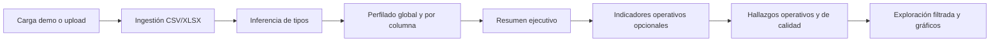

# Paradigm

Aplicación **standalone** en Python orientada a una **demo analítica** de operación de un **consultorio médico ambulatorio**: turnos, asistencia, facturación y coberturas, usando un **dataset oficial completamente sintético** incluido en el repositorio. El **motor de exploración** sigue siendo **genérico**: podés subir cualquier CSV o Excel (primera hoja) y obtener perfilado, filtros y gráficos sin depender del caso de consultorio.

---

## Disclaimer — datos ficticios

Este proyecto utiliza datos **completamente ficticios** y generados de forma **sintética** con fines demostrativos. **No contiene** información real de pacientes, profesionales ni operaciones de ninguna institución.

---

## Descripción breve

Paradigm permite:

- **Cargar el dataset demo** del consultorio con un clic (tabla plana `medical_clinic_flat.csv`) o **subir un archivo propio**.
- Obtener un **resumen ejecutivo** (volumen, nulos, duplicados, memoria, tipos inferidos, calidad estimada).
- Ver **indicadores operativos opcionales** y **hallazgos operativos del consultorio** cuando las columnas coinciden con el esquema del demo (sin afectar el comportamiento con otros datasets).
- Revisar **hallazgos de calidad de datos** heurísticos (duplicados, nulos altos, cardinalidad, etc.).
- Explorar una **vista filtrada** con gráfico exploratorio y **perfil por columna**.

---

## ¿Qué hace este MVP?

Una app **Streamlit** que carga tablas desde el navegador, infiere tipos lógicos, calcula métricas de perfilado y muestra KPIs y visualizaciones en **Plotly**. El caso principal de uso en portfolio es el **seguimiento operativo y administrativo simulado** del consultorio (patrones de turnos, cancelaciones, ingresos); el motor no asume reglas de negocio fijas salvo en la **capa opcional** activada por nombres de columnas del demo.

---

## Funcionalidades

| Área | Detalle |
|------|--------|
| **Carga** | CSV/XLSX por upload, o **botón** para cargar el dataset demo desde `data/sample/medical_clinic/medical_clinic_flat.csv`. |
| **Demo** | Banner de datos sintéticos cuando usás la carga demo. |
| **Inferencia de tipos** | Tipos lógicos: numérico, categórico, booleano, fecha/hora, texto, identificador. Etiquetas en español en la UI. |
| **Resumen ejecutivo** | KPIs globales y gráfico de columnas por tipo inferido. |
| **Indicadores operativos** | Solo si el archivo tiene las columnas del demo plano (turnos, estados, ingresos, cobertura, medio de pago). |
| **Hallazgos operativos** | Mensajes de contexto de consultorio (módulo aparte), si el esquema es compatible. |
| **Hallazgos de calidad** | Reglas genéricas sobre duplicados, nulos, cardinalidad, etc. |
| **Exploración** | Filtros en sidebar, vista previa, gráfico exploratorio sobre la vista filtrada. |
| **Perfil y nulos** | Tabla de perfil por columna y gráfico de % de nulos (dataset completo). |

---

## Stack tecnológico

- **Python** 3.10+
- **Streamlit** — interfaz web
- **Pandas** — datos tabulares
- **NumPy** — generación del dataset demo (script)
- **Plotly** — gráficos interactivos
- **openpyxl** — lectura de Excel (`.xlsx`)

---

## Estructura del proyecto

```
Paradigm/
├── app/
│   ├── main.py
│   ├── core/
│   │   ├── ingestion.py
│   │   ├── schema.py
│   │   ├── profiling.py
│   │   ├── exploration.py
│   │   ├── findings.py
│   │   ├── clinic_operational_kpis.py
│   │   ├── clinic_operational_insights.py
│   │   └── utils.py
│   └── visualization/
│       └── charts.py
├── data/
│   └── sample/
│       ├── medical_clinic/    # Dataset demo (consultorio)
│       └── ...
├── docs/
│   └── images/                # Capturas para README / portfolio (opcional)
├── scripts/
│   └── generate_medical_clinic_data.py
├── requirements.txt
└── README.md
```

---

## Instalación

```powershell
cd ruta\a\Paradigm
python -m venv .venv
.\.venv\Scripts\Activate.ps1
pip install -r requirements.txt
```

En Linux o macOS:

```bash
cd ruta/a/Paradigm
python3 -m venv .venv
source .venv/bin/activate
pip install -r requirements.txt
```

---

## Cómo ejecutar la app

Desde la **raíz del repositorio**:

```powershell
streamlit run app/main.py
```

Abrí la URL local que muestre Streamlit (por defecto `http://localhost:8501`).

---

## Dataset demo (consultorio médico)

- **Tabla principal para la app:** [`data/sample/medical_clinic/medical_clinic_flat.csv`](data/sample/medical_clinic/medical_clinic_flat.csv) (una fila por turno, con datos de paciente, profesional y facturación unidos).
- **Tablas separadas:** `patients.csv`, `professionals.csv`, `appointments.csv`, `billing.csv` (soporte narrativo y regeneración).

Regenerar datos sintéticos (misma semilla → mismos archivos):

```powershell
python scripts/generate_medical_clinic_data.py
```

Convención de columnas: **español**, `snake_case`; identificadores técnicos pueden usar sufijos `_id` en inglés.

---

## Cómo probar

1. Ejecutá la app.
2. Opción A: pulsá **«Cargar dataset demo (consultorio médico)»**.
3. Opción B: subí un CSV/XLSX (por ejemplo `data/sample/ventas_ejemplo.csv`).
4. Revisá resumen ejecutivo, indicadores operativos (si aplica), hallazgos, exploración y gráficos.

---

## Flujo funcional



---

## Limitaciones

- Una sola hoja en Excel (la primera).
- Inferencia heurística de tipos; puede equivocarse en casos límite.
- Pensado para datos que caben en memoria local.
- Sin base de datos, autenticación ni ML en esta versión.

---

## Capturas para portfolio

Podés guardar capturas en [`docs/images/`](docs/images/) y referenciarlas aquí, por ejemplo:

| Archivo sugerido | Contenido |
|------------------|-----------|
| `docs/images/01-carga-demo.png` | Botón de dataset demo y/o carga de archivo |
| `docs/images/02-banner-sintetico.png` | Banner de datos sintéticos |
| `docs/images/03-resumen-kpis.png` | Resumen ejecutivo e indicadores operativos |
| `docs/images/04-hallazgos.png` | Hallazgos operativos y de calidad |
| `docs/images/05-exploracion.png` | Filtros y gráfico exploratorio |

Sustituí las referencias por imágenes reales cuando las tengas:

```markdown

```

---

## Valor para portfolio / LinkedIn (ideas de mensaje)

- Análisis operativo de un consultorio ambulatorio con **datos sintéticos** y lógica realista.
- **Exploración automática**: tipos inferidos, calidad, filtros y gráficos sin configurar pipelines.
- **Transparencia ética**: datos ficticios explícitos en README y en la app.
- Combinación de **perfilado técnico** + **contexto de negocio** (turnos, cobertura, ingresos).

Texto corto para publicación (podés adaptarlo):

> Publicé **Paradigm**, una demo en Python/Streamlit que simula analítica operativa de un consultorio médico: turnos, estados, coberturas e ingresos sobre un **CSV 100 % sintético** versionado en el repo. Incluye perfilado automático, KPIs opcionales alineados al caso y hallazgos de calidad de datos. Los datos son ficticios y solo sirven para demostración.

---

## Licencia

**Licencia no especificada aún.** El autor puede definir una licencia abierta o restricciones cuando corresponda.

---

## Contacto / repositorio

Ajustá con el enlace al repositorio público o perfil profesional cuando publiques el proyecto.
