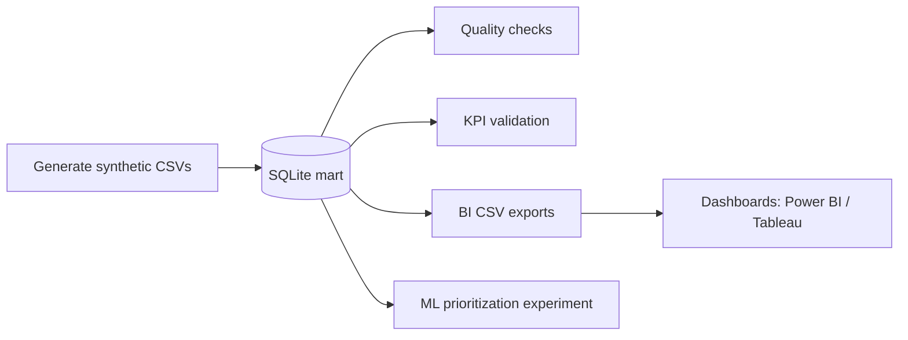
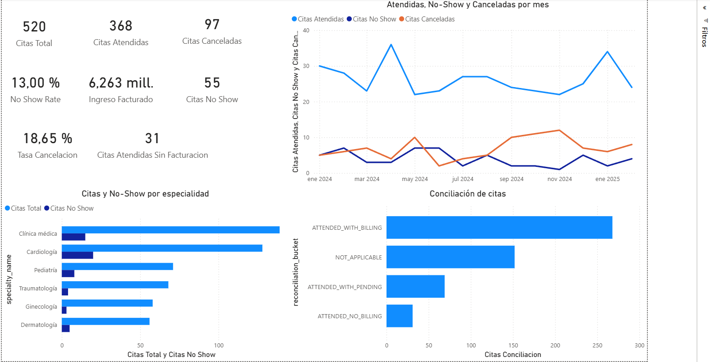

# Paradigm

**A reproducible synthetic healthcare analytics case study spanning data modeling, governed KPIs, BI evidence, and a scoped ML prioritization layer.**

> **Synthetic data:** All data in this repository is synthetic and exists only for demonstration, portfolio, and reproducibility purposes. It does not represent real patients, providers, organizations, or operational outcomes.

---

## Problem

Outpatient centers lose efficiency and revenue through **no-shows**, **late cancellations**, **schedule gaps**, and **misalignment between care delivered and billing**. Dashboards built without **governed metric definitions** and a **traceable dimensional model** are hard to audit: different teams can compute the “same” KPI differently, and historical charts alone rarely tell you what to fix first.

Paradigm is built around **analytical reliability**—definitions, lineage, validation, and reproducible outputs—not around charts as an end in themselves.

---

## Solution

Paradigm implements an end-to-end **analytics engineering** slice for outpatient operations:

| Layer | What it delivers |
|-------|-------------------|
| **Data** | A **synthetic** dimensional healthcare-style dataset (CSV) with explicit grain and keys |
| **Pipeline** | A **reproducible Python** sequence from generation through validation |
| **Mart** | A **SQLite** analytical mart with DDL and **KPI-oriented SQL views** |
| **Quality** | **Scripted data-quality checks** with a Markdown report |
| **Governance** | **Executive KPI validation** against the mart (script output) |
| **BI** | **CSV exports** and documented patterns for **Power BI** (executive lens) and **Tableau** (diagnostic lens) |
| **ML** | A **scoped no-show prioritization experiment** (same mart as BI), framed as methodology—not production prediction |

---

## Business context

Typical stakeholders this design speaks to:

| Stakeholder | Interest |
|-------------|----------|
| **Operations / clinic managers** | Utilization, no-shows, cancellations, trends |
| **Reception / scheduling** | Channels, lead time, friction by segment |
| **Billing / administration** | Billed revenue timing vs attended care, reconciliation gaps |
| **BI / analytics / data teams** | Clear grain, metric definitions, reproducible pipeline, evidence |

---

## Architecture

Single structured truth flows from synthetic generation to consumption (BI and ML read the same mart).



For more detail (dimensional layout, analytical lenses, implementation notes), see [`docs/architecture.md`](docs/architecture.md).

---

## Data pipeline

**Requirements:** Python 3.10+

From the repository root:

```bash
python -m venv .venv
# Windows: .venv\Scripts\activate   |   Linux/macOS: source .venv/bin/activate
pip install -r requirements.txt
```

Run the pipeline in order:

```bash
python scripts/generate_paradigm_v2_synthetic.py
python scripts/build_sqlite_mart.py
python scripts/run_data_quality.py
python scripts/export_powerbi_source.py
python scripts/export_tableau_source.py
python scripts/validate_executive_kpis.py
python scripts/train_no_show.py
```

| Command | Output |
|---------|--------|
| `python scripts/generate_paradigm_v2_synthetic.py` | Regenerates **`data/synthetic/*.csv`** (seeded synthetic source). |
| `python scripts/build_sqlite_mart.py` | Builds **`data/processed/paradigm_mart.db`** (DDL, load, views). Not committed to Git. |
| `python scripts/run_data_quality.py` | Writes **`reports/quality_report.md`** (checks + severities). |
| `python scripts/export_powerbi_source.py` | Writes **`bi/powerbi/source_csv/`** for Power BI import. |
| `python scripts/export_tableau_source.py` | Writes **`bi/tableau/source_csv/`** for Tableau import. |
| `python scripts/validate_executive_kpis.py` | Prints **reference KPI totals** for reconciliation with BI/SQL. |
| `python scripts/train_no_show.py` | Writes **`ml/experiments/metrics.json`** and **`.joblib`** pipelines (ignored by Git). |

---

## Data model (high level)

- **`fact_appointment`** — One row per **appointment** (patient, provider, specialty, channel, status, dates/timestamps).
- **`fact_billing_line`** — One row per **billing line** (amount, billing date, status); ties to appointments where applicable.

Dimensions include **calendar** (`dim_date`), **patients**, **providers**, **specialties**, **appointment status**, **booking channel**, **billing status**, **coverage / payer**, and **cancellation reason** (where relevant).

Full column-level documentation: [`docs/data_dictionary.md`](docs/data_dictionary.md).

---

## Governed KPIs

Definitions live in [`docs/metrics.md`](docs/metrics.md). At a glance, the mart supports (among others):

| Theme | Examples |
|-------|----------|
| **Volume** | Total appointments, attended appointments |
| **Rates** | No-show rate, cancellation rate (with explicit time anchoring per definition) |
| **Revenue** | Billed revenue by **`billing_date`**; line states include issued / pending / **void**; **strict cash collection** is not modeled as a production finance metric in the MVP (see dictionary for scope) |
| **Breakdowns** | By **specialty**, **provider**, **booking channel**, **coverage** — where exposed in views and exports |

**Validation:** [`scripts/validate_executive_kpis.py`](scripts/validate_executive_kpis.py) compares executive totals to the mart so KPI logic stays **auditable** alongside human-readable definitions.

---

## Dashboard evidence

Example **Power BI–style executive snapshot** (synthetic data):



The repository ships **CSV exports, DAX snippets, and build notes** under [`bi/powerbi/`](bi/powerbi/README.md) and [`bi/tableau/`](bi/tableau/README.md)—not checked-in `.pbix` / `.twbx` binaries. Optional Tableau-style captures and a unified asset layout may be added in a later documentation pass.

---

## ML layer (honest framing)

The ML layer is intentionally scoped as a **reproducible prioritization experiment** over synthetic data. The value is **not** raw model performance, but the **decision framing**: target definition, leakage prevention, temporal split, feature documentation, and operational use case. Current metrics on synthetic data show **ROC-AUC near or below 0.5**, which is documented as a **limitation of the synthetic generator** rather than presented as a production-ready predictive result.

Details, feature rules, and evaluation: [`ml/README.md`](ml/README.md).

---

## Tech stack

| Area | Tools |
|------|--------|
| Language | Python |
| Data / numerics | pandas, numpy |
| Database | SQLite |
| Analytics contract | SQL (DDL + views) |
| ML | scikit-learn |
| BI | Power BI, Tableau (documented consumption from mart exports) |
| Documentation | Markdown |

---

## How to run

```bash
python -m venv .venv
# Windows: .venv\Scripts\activate   |   Linux/macOS: source .venv/bin/activate
pip install -r requirements.txt
```

Then run the pipeline commands in [Data pipeline](#data-pipeline) in order.

**Optional legacy v1 Streamlit explorer** (not required for the v2 portfolio path):

```bash
pip install -r requirements-app.txt
streamlit run legacy/app/main.py
```

See [`legacy/README.md`](legacy/README.md).

---

## Repository structure

```
Paradigm/
├── assets/           # Portfolio visuals: dashboards/, diagrams/, walkthrough/ — see assets/README.md
├── bi/               # Power BI & Tableau exports and notes
├── data/
│   └── synthetic/    # Generated dimensional CSVs (regenerable)
├── docs/             # Case study, architecture, metrics, dictionaries
├── legacy/           # Paradigm v1 Streamlit + legacy sample CSVs
├── ml/               # ML README and experiments (artifacts mostly gitignored)
├── python/src/paradigm/   # Quality, I/O, ML package
├── reports/          # quality_report.md (regenerable evidence)
├── scripts/          # Pipeline entrypoints
└── sql/              # DDL, views, sample queries
```

---

## Limitations

- **Synthetic data only** — no clinical or commercial claims.
- **No production deployment** — local mart, scripts, and documented BI consumption.
- **No real patient data.**
- **No BI desktop binaries** in Git (`.pbix` / `.twbx` ignored); evidence is CSV + docs + optional screenshots.
- **ML is methodology-focused**, not benchmark-driven—see [`ml/README.md`](ml/README.md) and `ml/experiments/metrics.json`.

---

## Next steps

- **Stronger synthetic signal** — richer generators before tuning ML or claiming separation metrics.
- **Multi-site scenarios** — extend the dimensional model when scope warrants it.
- **Visual evidence pass** — consolidate dashboard screenshots and diagrams for clearer portfolio storytelling.
- **CI validation** — run pipeline scripts on a clean environment in GitHub Actions (or similar).

---

## License

This project is licensed under the [MIT License](LICENSE). Synthetic datasets are provided solely for demonstration, portfolio use, and reproducibility.

---

## Contact

- GitHub: [Agus-Delgado](https://github.com/Agus-Delgado)
- LinkedIn: [Agustín Delgado](https://www.linkedin.com/in/agustin-delgado-data98615190/)
