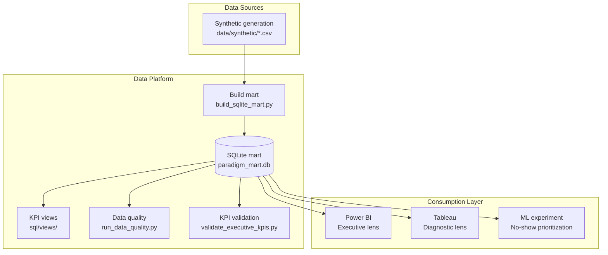

<div align="center">

# Paradigm

### End-to-end analytics engineering for outpatient operations

*From governed synthetic data to executive dashboards and an honest ML prioritization experiment — reproducible, auditable, portfolio-ready.*

*Del dato sintético gobernado al tablero ejecutivo y un experimento ML de priorización — reproducible de punta a punta.*

[](https://www.python.org/)
[](sql/README.md)
[](https://pandas.pydata.org/)
[](https://numpy.org/)
[](ml/README.md)
[](bi/powerbi/README.md)
[](bi/tableau/README.md)
[](#live-demo)
[](LICENSE)

[About](#about) · [KPIs](#key-results) · [Architecture](#architecture) · [Tech Stack](#tech-stack) · [Layers](#project-layers) · [Demo](#live-demo) · [Run](#how-to-run) · [ML](#ml-experiment)

</div>

---

> **Disclaimer — EN:** All data in this repository is **synthetic** and exists solely for demonstration, portfolio, and reproducibility. It does not represent real patients, providers, organizations, or operational outcomes.
>
> **Aviso — ES:** Todo el contenido es **sintético** y sirve solo para demostración, portfolio y reproducibilidad. No representa pacientes, prestadores ni resultados reales.
>
> **Realistic synthetic data · Portfolio project** · **Datos sintéticos realistas · Proyecto de portfolio**

---

## Table of Contents

| | |
|---|---|
| [About](#about) · [Sobre el Proyecto](#sobre-el-proyecto) | [Business Problem & Solution](#business-problem--solution) |
| [Key Results](#key-results) | [Architecture](#architecture) |
| [Tech Stack](#tech-stack) | [Project Layers](#project-layers) |
| [Live Demo](#live-demo) | [How to Run](#how-to-run) |
| [ML Experiment](#ml-experiment) | [Limitations](#limitations) · [Footer](#footer) |

---

## About

**Paradigm** is an end-to-end **analytics engineering** case study for outpatient clinic operations. It demonstrates how to move from raw (synthetic) data to a governed SQLite mart, validated KPIs, BI-ready exports, and a transparent ML prioritization experiment — with full lineage and reproducibility.

The focus is **analytical reliability**: governed metric definitions, automated quality checks, SQL contracts, and auditable outputs — not charts as an end in themselves.

Deep dives: [`docs/architecture.md`](docs/architecture.md) · [`docs/portfolio.md`](docs/portfolio.md)

---

## Sobre el Proyecto

**Paradigm** es un caso de estudio de **analytics engineering** para operaciones ambulatorias: dato sintético → mart SQLite → KPIs validados → BI y ML reproducibles.

El foco es **confiabilidad analítica** — definiciones gobernadas, calidad automatizada y evidencia auditable — no gráficos aislados.

---

## Business Problem & Solution

### The problem

Outpatient centers lose efficiency and revenue through **no-shows**, **late cancellations**, **schedule gaps**, and **misalignment between care delivered and billing**. When dashboards are built without **governed KPI definitions** and a **traceable dimensional model**, the same metric can be calculated differently across teams — and historical charts alone do not say **what to fix first**.

### La solución · The solution

| Layer | Deliverable |
|-------|-------------|
| **Data** | Dimensional synthetic dataset (CSV) with explicit grain and keys |
| **Pipeline** | Reproducible Python sequence: generate → mart → quality → export |
| **Mart** | Local **SQLite** database with DDL and **KPI-oriented SQL views** |
| **Quality** | Automated checks with auditable Markdown report |
| **Governance** | Executive KPI validation against the mart |
| **BI** | CSV exports + documented patterns for **Power BI** (executive) and **Tableau** (diagnostic) |
| **ML** | Scoped **no-show prioritization** experiment (methodology, not production prediction) |

**El problema (resumen):** no-shows, cancelaciones tardías, huecos de agenda y desalineación atención–facturación. Sin KPIs gobernados y modelo dimensional trazable, cada equipo calcula distinto y los tableros no priorizan acciones.

---

## Key Results

Reference numbers from the full mart (`python scripts/validate_executive_kpis.py`), aligned to the executive dashboard. Formal definitions: [`docs/metrics.md`](docs/metrics.md)

| Metric | Value | Context | Business Impact |
|--------|------:|---------|-----------------|
| **Total appointments** | **520** | Jan 2024 – Feb 2025 | Full-period operational baseline |
| **Attended** | **368** | 70.8% of agenda volume | Capacity actually utilized |
| **No-show rate** | **13.0%** | 55 no-shows · denom.: attended + no-show | Recoverable slots & revenue risk |
| **Cancellation rate** | **18.7%** | 97 cancelled appointments | Rebooking opportunity & planning noise |
| **Billed revenue** | **6,904,253 ARS** | Non-`VOID` billing lines (~$6.9 M) | Revenue recognized in the mart |
| **Billing gap** | **31** | Attended without billing line | Reconciliation & leakage control |
| **Dimensional model** | **11 dims + 2 facts** | 6 specialties · 8 providers | Governed star schema for BI & ML |
| **SQL contract** | **5 views** | Daily, specialty, provider, revenue bridge | Single source of truth for KPIs |
| **Data quality** | **14 checks** | 13 OK · 1 expected WARN (billing gap) | Auditable trust before consumption |

| Indicador | Valor | Impacto |
|-----------|------:|---------|
| Citas totales | 520 | Línea base del período |
| Tasa no-show | 13,0 % | Slots y revenue recuperables |
| Ingreso facturado | ~6,9 M ARS | Revenue reconocido |
| Brecha operativa | 31 citas | Conciliación atención–facturación |

---

## Architecture

A single structured source feeds BI and ML from the same mart.



Full model, analytic lenses, and implementation: [`docs/architecture.md`](docs/architecture.md)

---

## Tech Stack

| Area | Tools | Purpose (EN) | Propósito (ES) |
|------|-------|--------------|----------------|
| **Language** | Python 3.10+ | Pipeline orchestration | Orquestación del pipeline |
| **Data** | pandas · numpy · CSV | Synthetic dimensional datasets | Datasets sintéticos dimensionales |
| **Storage** | SQLite | Local analytic mart | Mart analítico local |
| **SQL contract** | DDL + 5 KPI views + 5 samples | Governed metric layer | Capa de métricas gobernadas |
| **Quality** | `paradigm.quality` (14 rules) | Automated mart validation | Validación automatizada del mart |
| **BI** | Power BI · Tableau Desktop | CSV consumption (no binaries in Git) | Consumo vía CSV export |
| **ML** | scikit-learn · joblib | Temporal split, ranking metrics | Split temporal, métricas de ranking |
| **Streamlit v2** | Streamlit · Plotly · mart SQLite | Live Demo — KPIs, conciliación, ML sim | Demo interactivo principal del portfolio |
| **Legacy app** | Streamlit · Plotly (v1) | Optional CSV explorer | Explorador interactivo opcional (v1) |
| **Docs** | Markdown · Mermaid | Regenerable reports & diagrams | Reportes y diagramas regenerables |

*Local reproducibility by design; optional Docker setup for the Live Demo — see [How to Run](#how-to-run).*

---

## Project Layers

| Layer | Description | Enlace |
|-------|-------------|--------|
| **Data** | Synthetic CSVs, fact grain, dimensions | [`data/README.md`](data/README.md) · [`data/synthetic/README.md`](data/synthetic/README.md) |
| **SQL** | DDL, KPI views, business queries | [`sql/README.md`](sql/README.md) |
| **Python** | Pipeline, quality, I/O, ML module | [`python/README.md`](python/README.md) |
| **BI — Power BI** | CSV export, DAX measures, build guide | [`bi/powerbi/README.md`](bi/powerbi/README.md) |
| **BI — Tableau** | CSV export, exploratory patterns | [`bi/tableau/README.md`](bi/tableau/README.md) |
| **ML** | Experiment framing, features, honest evaluation | [`ml/README.md`](ml/README.md) |
| **Docs** | Metrics, dictionary, analytical questions, portfolio | [`docs/metrics.md`](docs/metrics.md) · [`docs/data_dictionary.md`](docs/data_dictionary.md) · [`docs/portfolio.md`](docs/portfolio.md) |
| **Legacy** | Paradigm v1 — Streamlit + sample data | [`legacy/README.md`](legacy/README.md) |

### Repository structure

```
Paradigm/
├── assets/              # Dashboard screenshots & diagrams
├── bi/                  # Power BI and Tableau — exports and notes
├── data/
│   ├── synthetic/       # Dimensional CSVs (regenerable)
│   └── processed/       # paradigm_mart.db (generated locally)
├── docs/                # Architecture, metrics, dictionary, portfolio
├── app/                 # Streamlit v2 Live Demo modules
├── streamlit_app.py     # Entry point — streamlit run streamlit_app.py
├── legacy/              # Paradigm v1 — Streamlit + sample clinic data
├── ml/                  # Experiment README and artifacts
├── python/src/paradigm/ # Quality, I/O, and ML module
├── reports/             # quality_report.md (regenerable evidence)
├── scripts/             # Pipeline entrypoints
└── sql/                 # DDL, views, and sample queries
```

---

## Live Demo

### Interactive demo (Streamlit v2) — recommended

App principal del portfolio: KPIs ejecutivos, conciliación atención–facturación y simulación de no-show conectados al mart SQLite.

```bash
pip install -r requirements-app.txt
python scripts/build_sqlite_mart.py          # si no existe data/processed/paradigm_mart.db
python scripts/train_no_show.py              # opcional — tab No-Show ML
streamlit run streamlit_app.py
```

Abre `http://localhost:8501`. Filtros en sidebar (fecha, especialidad, proveedor, canal). Botón **Regenerar datos** disponible en el sidebar (requiere confirmación).

| Sección | Contenido |
|---------|-----------|
| **Executive Overview** | 6 KPIs, tendencia temporal, breakdown por especialidad, card de brecha |
| **Conciliación** | ATTENDED_NO_BILLING, comparativa atención vs facturación |
| **No-Show ML** | Formulario de simulación + probabilidad y recomendación |

---

**Power BI** executive view — full-period synthetic snapshot for portfolio evidence:


| Lens | Role | Status |
|------|------|--------|
| **Streamlit v2** | Live Demo interactivo — mart + ML | `streamlit run streamlit_app.py` |
| **Power BI** | Executive monitoring — "what happened" | CSV exports, DAX snippets, build instructions in [`bi/powerbi/`](bi/powerbi/README.md) |
| **Tableau** | Diagnostic exploration — "where to dig" | CSV exports and patterns in [`bi/tableau/`](bi/tableau/README.md) |
| **Streamlit (legacy v1)** | Optional CSV explorer | `streamlit run legacy/app/main.py` — see [How to Run](#how-to-run) |

**Suggested demo order:** Streamlit v2 → Executive (Power BI) → Diagnostic (Tableau) → Quality report → ML methodology. Details: [`docs/portfolio.md`](docs/portfolio.md)

No `.pbix` / `.twbx` binaries are versioned — evidence via CSV, docs, and screenshots.

---

## How to Run

**Requirements:** Python 3.10+ (local) · Docker + Docker Compose v2 (container)

### Docker (recommended for quick demo)

Runs the Streamlit v2 Live Demo without a local Python venv. Persistent data lives on the host via mounted volumes.

**Prerequisites:** [Docker](https://docs.docker.com/get-docker/) and Docker Compose v2.

**First run** — generate synthetic CSVs, build the SQLite mart, and train ML models:

```bash
docker compose --profile init run --rm db
```

**Start the app:**

```bash
docker compose up --build
```

Open `http://localhost:8501`.

| Command | Purpose |
|---------|---------|
| `docker compose up -d` | Run in background |
| `docker compose down` | Stop containers |
| `docker compose exec app python scripts/build_sqlite_mart.py` | Rebuild mart manually |
| `docker compose --profile init run --rm db` | Full regenerate (CSV → mart → ML) |

**Volumes:** `./data/processed` (SQLite mart) and `./ml/experiments` (joblib models + metrics) are bind-mounted into the container. If you already have `data/processed/paradigm_mart.db` locally, it is used automatically. The init profile also writes regenerated CSVs to `./data/synthetic` on the host.

---

### 1. Environment setup (local)

```bash
python -m venv .venv
```

**Windows (PowerShell / CMD):**

```bash
.venv\Scripts\activate
pip install -r requirements.txt
```

**Linux / macOS:**

```bash
source .venv/bin/activate
pip install -r requirements.txt
```

### 2. Full pipeline (recommended order)

```bash
python scripts/generate_paradigm_v2_synthetic.py
python scripts/build_sqlite_mart.py
python scripts/run_data_quality.py
python scripts/export_powerbi_source.py
python scripts/export_tableau_source.py
python scripts/validate_executive_kpis.py
python scripts/train_no_show.py
```

| Script | Main output | What it does |
|--------|---------------|--------------|
| `generate_paradigm_v2_synthetic.py` | `data/synthetic/*.csv` | Generates dimensional synthetic CSVs |
| `build_sqlite_mart.py` | `data/processed/paradigm_mart.db` | Builds SQLite mart (DDL + views) |
| `run_data_quality.py` | `reports/quality_report.md` | Runs 14 quality checks on the mart |
| `export_powerbi_source.py` | `bi/powerbi/source_csv/` | Exports CSVs for Power BI |
| `export_tableau_source.py` | `bi/tableau/source_csv/` | Exports CSVs for Tableau |
| `validate_executive_kpis.py` | Console reference totals | Validates executive KPIs against mart |
| `train_no_show.py` | `ml/experiments/metrics.json` | Trains no-show prioritization models |

### 3. Live Demo — Streamlit v2 (recommended)

```bash
pip install -r requirements-app.txt
python scripts/build_sqlite_mart.py
python scripts/train_no_show.py    # optional, for No-Show ML tab
streamlit run streamlit_app.py
```

### 4. Optional — legacy v1 Streamlit explorer

```bash
pip install -r requirements-app.txt
streamlit run legacy/app/main.py
```

### 5. Optional — SQL sample queries

```bash
sqlite3 data/processed/paradigm_mart.db < sql/samples/01_no_show_by_specialty.sql
```

### Cómo ejecutar (resumen)

**Docker (recomendado para demo):** `docker compose --profile init run --rm db` → `docker compose up --build` → `http://localhost:8501`.

**Local:** mismo flujo en Windows y Linux/macOS: `venv` → `pip install -r requirements.txt` → ejecutar los 7 scripts en orden. Live Demo v2 con `requirements-app.txt` y `streamlit run streamlit_app.py`.

---

## ML Experiment

Scoped **no-show prioritization** experiment on synthetic data: target definition, leakage prevention, temporal split, and ranking metrics — **not** a production-ready model.

| Aspect | Detail |
|--------|--------|
| **Problem** | Prioritize appointments by no-show risk at booking time |
| **Target** | `1` = NO_SHOW, `0` = ATTENDED; cancelled rows excluded |
| **Split** | Temporal by `appointment_date`; cutoff **2024-12-05**; 332 train / 91 test |
| **Models** | Logistic regression (baseline) · Random Forest (120 trees) |

**Honest metrics** (`ml/experiments/metrics.json`):

| Model | ROC-AUC | PR-AUC | Top-decile capture |
|-------|--------:|-------:|-------------------:|
| Logistic baseline | **0.41** | 0.11 | 9.1% |
| Random Forest | **0.42** | 0.11 | 9.1% |

ROC-AUC near **0.40–0.42** reflects **weak synthetic signal**, not a broken pipeline. The experiment demonstrates methodology, evaluation plumbing, and portfolio honesty.

**Improvement paths with real data:** richer patient histories, segment-specific features, calibration, production monitoring, and organizational validation.

Full detail: [`ml/README.md`](ml/README.md)

### Data model summary

- **`fact_appointment`** — One row per **appointment** (patient, provider, specialty, channel, status, dates).
- **`fact_billing_line`** — One row per **billing line** (amount, date, status).

Dimensions: calendar (`dim_date`), patients, providers, specialties, appointment status, booking channel, billing status, coverage, and cancellation reason.

Column-level documentation: [`docs/data_dictionary.md`](docs/data_dictionary.md)

---

## Limitations

- **Synthetic data only** — no clinical or commercial claims.
- **No production deployment** — local mart, scripts, and documented BI consumption.
- **No real patient data (PHI).**
- **No BI binaries in Git** — evidence via CSV, docs, and screenshots.
- **ML is methodology-first** — see [`ml/README.md`](ml/README.md) and `ml/experiments/metrics.json`.

- Solo datos sintéticos · sin despliegue productivo · sin PHI · ML orientado a metodología.

---

## Footer

| | |
|---|---|
| **GitHub** | [Agus-Delgado](https://github.com/Agus-Delgado) |
| **LinkedIn** | [Agustín Delgado](https://www.linkedin.com/in/agustin-delgado-data98615190/) |
| **Portfolio guide** | [`docs/portfolio.md`](docs/portfolio.md) |
| **License** | [MIT License](LICENSE) |

<div align="center">

**Built with ❤️ for portfolio & interview preparation**

*Hecho con ❤️ para portfolio y preparación de entrevistas*

**Paradigm** — *clear definitions, reproducible pipeline, auditable evidence.*

*definiciones claras, pipeline reproducible, evidencia auditable.*

</div>
