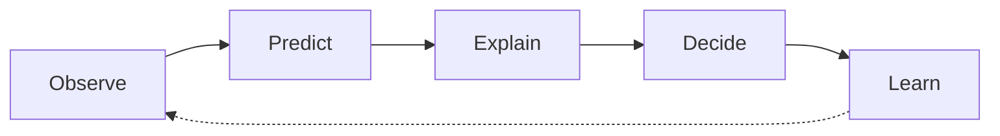

<div align="center">

# Paradigm

### Decision Intelligence Laboratory

**De la evidencia gobernada a opciones de decisión auditables** — operaciones ambulatorias sintéticas, pipeline reproducible, demo Streamlit.

*Observe → Predict → Explain → Decide → Learn · portfolio-ready · v2.2*

[](https://www.python.org/)
[](#demo)
[](ml/README.md)
[](LICENSE)

[Problema](#problema) · [Arquitectura](#arquitectura) · [Capacidades](#capacidades) · [Resultados](#resultados) · [Limitaciones](#limitaciones) · [Demo](#demo) · [Ejecución](#ejecución-local) · [Ecosistema](#ecosistema)

</div>

---

> **Disclaimer:** Datos **100 % sintéticos** — demostración y portfolio únicamente. No representa pacientes, prestadores ni resultados operativos reales. Asociación ≠ causalidad; Decide **no** automatiza campañas.

**Docs clave:** [`docs/FINAL_ARCHITECTURE.md`](docs/FINAL_ARCHITECTURE.md) · [`docs/PORTFOLIO_CASE_STUDY.md`](docs/PORTFOLIO_CASE_STUDY.md) · [`docs/PUBLICATION_AUDIT.md`](docs/PUBLICATION_AUDIT.md)

---

## Problema

Los centros ambulatorios pierden eficiencia e ingreso por **no-shows**, **cancelaciones tardías**, **huecos de agenda** y **desalineación atención–facturación**.

Sin KPIs gobernados ni un modelo dimensional trazable, cada equipo calcula distinto. Los tableros históricos responden *qué pasó*, pero no priorizan *a quién contactar hoy* bajo capacidad y costo.

**Paradigm** demuestra un laboratorio completo: evidencia auditable → predicción → explicación → decisión operativa simulada → aprendizaje (experimentos, calidad, eval).

---

## Arquitectura

```text
Observe → Predict → Explain → Decide → Learn
```

| Capa | Rol |
|------|-----|
| **Observe** | Datos sintéticos, mart SQLite, calidad, KPIs, BI dual-lens |
| **Predict** | No-show (mart + lab v2), forecasting, uplift (lab) |
| **Explain** | SHAP, analista conversacional (LLM/heurística), eval gold |
| **Decide** | Motor `paradigm.prescriptive` + chat Decide; what-if UI |
| **Learn** | `ml/experiments/runs/`, drift, CI + tests |



Detalle y mapa del repo: [`docs/FINAL_ARCHITECTURE.md`](docs/FINAL_ARCHITECTURE.md).

**Stacks:** portfolio mart (`data/synthetic/` + `paradigm.ml`) y lab paralelo (`synthetic_v2` + `ml_v2` + Decide). La UI consume artefactos; no es la fuente de verdad.

---

## Capacidades

| Capacidad | Qué demuestra |
|-----------|----------------|
| Mart gobernado | DDL, vistas KPI, 14 checks de calidad, validación ejecutiva |
| BI dual-lens | Power BI (monitoreo) + Tableau (diagnóstico) sobre la misma verdad |
| Predict | Ranking no-show con split temporal + forecast de demanda |
| Explain | SHAP, chat con fuentes, fallback sin LLM |
| Decide | Política riesgo/uplift/ENV, capacidad, sensibilidad de costo |
| Learn | Runs estructurados, tests, CI sin Streamlit en el job core |

Landing de la demo:


---

## Resultados

Referencia del mart completo (`validate_executive_kpis.py`). Definiciones: [`docs/metrics.md`](docs/metrics.md).

| Métrica | Valor | Lectura |
|---------|------:|---------|
| Citas totales | **520** | Línea base ene-2024 – feb-2025 |
| Tasa no-show | **13,0 %** | Slots / revenue recuperables |
| Cancelaciones | **18,7 %** | Ruido de planificación |
| Ingreso facturado | **~6,9 M ARS** | Revenue reconocido en el mart |
| Brecha atención–billing | **31** | Conciliación operativa |
| Calidad | **14 checks** (1 WARN esperado) | Confianza antes de consumir |

**ML (portfolio — metodología, no trofeo):** en sintético del mart, ROC-AUC ~0,40–0,42 es **esperable** (señal débil). El lab `synthetic_v2` muestra señal controlable (p. ej. AUC ~0,65 en escenario moderate). Ver [`ml/README.md`](ml/README.md).

---

## Limitaciones

- Datos **sintéticos**: no validan performance de negocio real ni políticas clínicas.
- Decide usa reglas + scores / uplift estimado; **no** es un RCT ni despliegue de contacto.
- SHAP y el chat **no** implican causalidad.
- `legacy_bridge` aún acopla profiling v1 al analista conversacional.
- CI valida imports core, pytest, mart, quality y KPIs — **no** entrena ML ni el lab v2 completo en cada push.

---

## Demo

```bash
pip install -r requirements-app.txt
python scripts/build_sqlite_mart.py
streamlit run streamlit_app.py
```

Abre `http://localhost:8501`. Tabs: Executive Overview · Conciliación · No-Show ML · Forecasting · AI Conversational Insights (incluye consultas Decide).

| Vista | Captura |
|-------|---------|
| Landing |  |
| Análisis |  |
| No-Show SHAP |  |
| Power BI |  |

Orden sugerido de demo: [`docs/PORTFOLIO_CASE_STUDY.md`](docs/PORTFOLIO_CASE_STUDY.md) · checklist: [`docs/portfolio.md`](docs/portfolio.md).

---

## Ejecución local

**Requisitos:** Python 3.10+ · opcional Make / Docker.

```bash
python -m venv .venv
# Windows: .venv\Scripts\activate
pip install -r requirements.txt -r requirements-dev.txt   # core + tests
pip install -r requirements-app.txt                       # demo Streamlit

make all          # synthetic → mart → quality → BI → no-show
make run-app      # streamlit
pytest tests/ -v
```

Sin Make:

```bash
python scripts/generate_paradigm_v2_synthetic.py
python scripts/build_sqlite_mart.py
python scripts/run_data_quality.py
python scripts/train_no_show.py
streamlit run streamlit_app.py
```

**Lab v2 (opcional):** `scripts/generate_synthetic_v2.py` → `train_no_show_v2.py` / `train_uplift_v2.py` / `run_prescriptive_engine.py`.

**Docker:** `docker compose --profile init run --rm db` luego `docker compose up --build`.

**LLM (opcional):** copiar `.env.example` → `.env`. Sin clave, el analista usa heurística + Decide determinístico.

---

## Ecosistema

Paradigm forma parte de un trío de portfolio orientado a decisiones con evidencia:

| Proyecto | Rol |
|----------|-----|
| **ClarusFlow** | Prepara y gobierna datos (pipelines, calidad, contratos listos para consumo). |
| **LumenVox** | Interpreta lenguaje (NL → intención / SQL / narrativa) para interrogación analítica. |
| **Paradigm** | Convierte evidencia en **opciones de decisión** (Observe → Decide → Learn). |

```text
ClarusFlow ──datos gobernados──▶ Paradigm ──decisiones──▶ operación (humana)
LumenVox   ──lenguaje / NL─────▶ Paradigm (Explain + chat)
```

Cada pieza es independiente; juntas narran el camino **dato → lenguaje → decisión**.

---

## Tech stack (resumen)

Python · pandas · SQLite · scikit-learn · SHAP · Streamlit · Plotly · Power BI / Tableau (CSV) · pytest · GitHub Actions.

Capas del repo: [`docs/FINAL_ARCHITECTURE.md`](docs/FINAL_ARCHITECTURE.md) · tests: [`tests/README.md`](tests/README.md).

---

## Publicación

Antes de push público: seguir [`docs/PUBLICATION_AUDIT.md`](docs/PUBLICATION_AUDIT.md) (secretos, artefactos, checklist GitHub).

---

## License

MIT — ver [`LICENSE`](LICENSE).
