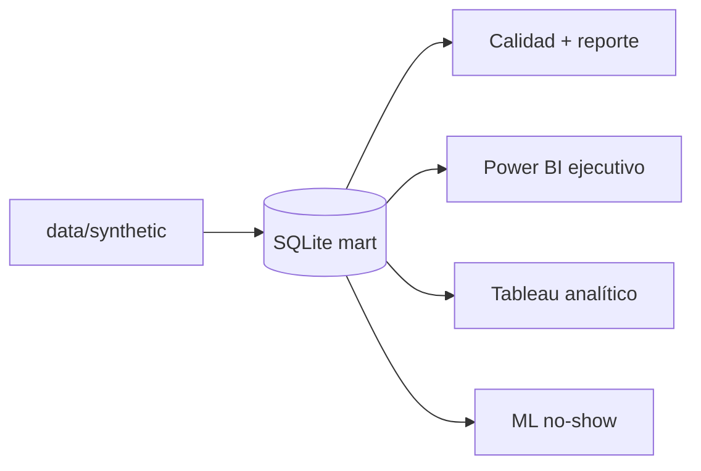

# Paradigm v2

**Paradigm** es una **demo reproducible de inteligencia operativa aplicada**: combina modelado de datos, **métricas auditables**, análisis **diagnóstico**, una **capa predictiva acotada** (riesgo de no-show) y **lectura orientada a decisión**. Los datos son **sintéticos** y ficticios; el valor está en **criterio analítico, gobernanza de métricas y narrativa defendible**, no en fingir hallazgos de un centro real.

---

## 1. Qué es Paradigm

Paradigm muestra un recorrido **descriptivo → diagnóstico → predictivo → explicativo** sobre operación ambulatoria: un mart dimensional en **SQL** (SQLite), calidad reproducible en **Python**, consumo en **Power BI** (monitoreo ejecutivo) y **Tableau** (análisis y causa), y **ML** como complemento para priorización. Las herramientas son **soporte**; el foco está en el **problema operativo** y en la **decisión** que permiten datos bien estructurados.

---

## 2. Qué problema busca abordar

Los centros ambulatorios pierden eficiencia e ingresos por huecos de agenda, **no-shows**, cancelaciones (en particular tardías) y **desalineación** entre atención y facturación. Sin definiciones explícitas de métricas y un modelo de datos trazable, es difícil auditar tableros, comparar periodos y traducir números en **acciones** concretas.

**Lectura ampliada:** [`docs/business_case.md`](docs/business_case.md).

---

## 3. Por qué no alcanza con visualizar solo datos históricos

Un dashboard que solo muestra el pasado suele:

- **Rezago:** el tablero refleja hechos ya ocurridos; no sustituye por sí solo la anticipación donde importa.
- **Sin priorización:** muchos KPIs sin reglas de **priorización** ni riesgo explícito no dejan claro *qué* atacar primero.
- **No explicitar riesgo operativo:** el histórico solo rara vez traduce patrones en **probabilidad de eventos** relevantes (p. ej. no-show) en el momento de decidir.
- **No cerrar el circuito acción–impacto:** sin diagnóstico y sin lectura explicativa, los patrones no siempre se convierten en **señales accionables**.

Paradigm suma **diagnóstico por cortes**, **calidad y definiciones de métricas**, y una **capa predictiva acotada** con **explicabilidad** (importancias, limitaciones documentadas) para acercar el análisis a decisiones operativas.

---

## 4. Arquitectura lógica del proyecto

Flujo implementado (misma verdad estructurada para BI y ML):

```text
data/synthetic (CSV)  →  build SQLite mart  →  calidad Python  →  consumo (BI / ML)
```

- **Contrato analítico:** DDL y vistas en [`sql/`](sql/README.md); KPIs alineados a [`docs/metric_definitions.md`](docs/metric_definitions.md).
- **Verdad operativa local:** `data/processed/paradigm_mart.db` (generado; no versionado).
- **Consumo:** CSV desde el mart (`export_powerbi_source.py`, `export_tableau_source.py`) o cliente SQL; el ML lee el mismo mart.

**Detalle y arquitectura analítica:** [`docs/architecture.md`](docs/architecture.md).



---

## 5. Capas analíticas del proyecto

| Capa | Propósito | Dónde aparece en el repo | Lectura o decisión que habilita |
|------|------------|---------------------------|----------------------------------|
| **Descriptiva** | Estado operativo actual: volumen, tasas, tendencias, conciliación básica | Vistas SQL `vw_*`, exportes BI, KPIs en [`docs/metric_definitions.md`](docs/metric_definitions.md); Power BI ejecutivo | Saber *qué* pasa y *hacia dónde* apuntan las métricas del periodo |
| **Diagnóstica** | Patrones, cortes y fricción por especialidad, canal, tiempo, etc. | Vistas y exploración Tableau (`bi/tableau/`); lectura de causa sin mezclar con el tablero mínimo ejecutivo | Entender *dónde* mirar y *qué* segmentos conviene revisar |
| **Predictiva** | Anticipar un evento operativo relevante con propósito explícito | [`ml/README.md`](ml/README.md), `scripts/train_no_show.py`, `ml/experiments/` | **Priorización** (p. ej. recordatorios) sobre un score, no reemplazo del criterio humano |
| **Explicativa** | Traducir salidas técnicas en lecturas accionables y límites honestos | Importancias de modelo en `metrics.json`, secciones de interpretación en `ml/README.md`; narrativa en docs | Conectar señal con **interpretación**, **impacto posible** y **acción** sin caja negra |

---

## 6. Stack y rol de cada componente

| Capa | Herramienta | Rol en Paradigm v2 |
|------|-------------|-------------------|
| Datos | CSV sintéticos + SQLite | Fuente única para BI y ML; portable para portfolio |
| SQL | DDL + vistas `vw_*` | Contrato de KPIs; muestras en `sql/samples/` |
| Python | `paradigm` (calidad, ML) | `run_data_quality.py`, exports BI, `train_no_show.py` |
| Power BI | Desktop (diseño documentado) | **Vista ejecutiva / monitoreo** — pocas señales y tendencia; `bi/powerbi/` |
| Tableau | Desktop (diseño documentado) | **Vista analítica / diagnóstico** — mismos datos, lectura de causa; `bi/tableau/` |
| ML | scikit-learn | **Capa predictiva complementaria** — riesgo de no-show; `ml/experiments/metrics.json` (en sintético el desempeño puede ser débil; vale la **metodología**) |

---

## 7. Caso inicial en salud (ambulatoria)

- **Hechos:** `fact_appointment` (grano cita), `fact_billing_line` (grano línea de cargo).
- **KPIs clave (MVP):** no-show y cancelación (con anclajes temporales definidos), citas atendidas, ingreso facturado (`billing_date`), conciliación atención–facturación; ocupación como **proxy** documentada donde aplique.

**Fuente normativa:** [`docs/metric_definitions.md`](docs/metric_definitions.md) y [`docs/data_dictionary.md`](docs/data_dictionary.md).

---

## 8. Adaptabilidad conceptual a otros contextos

La lógica del proyecto —operación con agenda, asistencia, cancelaciones, uso de recursos y **riesgo operativo**— es **trasladable en términos conceptuales** a organizaciones con interacción recurrente (clubes, colegios, centros de atención, comunidades). **No hay otras verticales implementadas** en el repo; el caso construido sigue siendo **salud ambulatoria**.

---

## 9. Flujo reproducible (desde la raíz del repo)

**Requisitos:** Python 3.10+

```bash
python -m venv .venv
# Windows: .venv\Scripts\activate  |  Linux/macOS: source .venv/bin/activate
pip install -r requirements.txt
```

**Pipeline analítico v2:**

```bash
python scripts/generate_paradigm_v2_synthetic.py
python scripts/build_sqlite_mart.py
python scripts/run_data_quality.py
python scripts/export_powerbi_source.py
python scripts/export_tableau_source.py
python scripts/validate_executive_kpis.py
python scripts/train_no_show.py
```

| Paso | Salida relevante |
|------|-------------------|
| Sintético | `data/synthetic/*.csv` |
| Mart | `data/processed/paradigm_mart.db` |
| Calidad | [`reports/quality_report.md`](reports/quality_report.md) |
| Power BI | `bi/powerbi/source_csv/` |
| Tableau | `bi/tableau/source_csv/` |
| ML | `ml/experiments/metrics.json`, modelos `.joblib` |

**Referencias:** [`sql/README.md`](sql/README.md), [`python/README.md`](python/README.md), [`bi/powerbi/README.md`](bi/powerbi/README.md), [`bi/tableau/README.md`](bi/tableau/README.md), [`ml/README.md`](ml/README.md).

---

## 10. Demo, evidencia y entregables

### Vista ejecutiva (ejemplo)


Vista del tablero ejecutivo en Power BI (datos sintéticos): KPIs del periodo, tendencia operativa y lectura rápida para dirección, alineada al diccionario de métricas.

### Dónde encontrar evidencia

| Qué | Dónde |
|-----|--------|
| Captura **Power BI** (ejecutivo) | Ejemplo en la landing: [`public/img/Dashboard_ejecutivo.png`](public/img/Dashboard_ejecutivo.png). Opcional (misma idea, nombre unificado): `assets/bi/powerbi_executive.png` — ver [`assets/README.md`](assets/README.md) y [`docs/portfolio_evidence.md`](docs/portfolio_evidence.md) |
| Captura **Tableau** (analítico) | Cuando la generes: [`assets/bi/tableau_analytics.png`](assets/README.md) (convención única con `portfolio_evidence` y esta tabla) |
| **Quality report** | [`reports/quality_report.md`](reports/quality_report.md) (regenerable) |
| **Métricas ML** | [`ml/experiments/metrics.json`](ml/experiments/metrics.json) (regenerable; no inflar interpretación en datos sintéticos) |

### Entregables BI y ML

| Entregable | Qué incluye el repo | Armado manual |
|------------|---------------------|---------------|
| **Power BI ejecutivo** | CSV, medidas DAX, validación, instrucciones de lienzo | El **`.pbix`** se construye en Power BI Desktop (binario no versionado por defecto) |
| **Tableau analítico** | CSV + especificación de historias y métricas | El **`.twbx`** se construye en Tableau Desktop de la misma forma |
| **ML no-show** | Script + modelos serializables + `metrics.json` | Inferencia batch opcional; sin servicio en producción |

No se declaran tableros “terminados” en binario: sí hay **material y documentación** para reproducirlos o mostrarlos en demo.

**Cómo presentar el proyecto:** [`docs/portfolio_presentation.md`](docs/portfolio_presentation.md) (guion de demo, recorrido visual, pitches y defensa técnica). **Orden y rutas de capturas:** [`docs/portfolio_evidence.md`](docs/portfolio_evidence.md).

---

## 11. Roadmap

**Estado (v2):** documentación base, sintético, mart, vistas, calidad, Power BI y Tableau **preparados**, ML **reproducible y documentado**.

**Marco analítico (Sprint 2, documentación):** preguntas troncales T1–T6, matriz pregunta → KPI / SQL / BI / acción, casos UC1–UC5, plantilla de explicabilidad del no-show y frontera documentación vs implementación futura — ver [`docs/analytical_questions.md`](docs/analytical_questions.md).

**Demo y portfolio (Sprint 3, documentación):** guion de demo paso a paso, recorrido visual, orden de evidencia, pitch corto / medio / recorrido con pantalla / defensa técnica, y convención única `public/img` vs `assets/bi` — ver [`docs/portfolio_presentation.md`](docs/portfolio_presentation.md) y [`docs/portfolio_evidence.md`](docs/portfolio_evidence.md).

Pendientes típicos de portfolio: colocar **capturas** reales en `assets/bi/` si querés uniformar nombres con la guía, publicar repo y ajustar contacto/licencia cuando corresponda.

---

## 12. Alcance actual y fuera de alcance

**Incluido en el estado actual:** demo documental y técnica descrita en este README; identidad de **inteligencia operativa aplicada** con cuatro capas analíticas; caso **salud ambulatoria**; datos ficticios con foco metodológico.

**Fuera de alcance del MVP** (sin reabrir decisiones): multi-sede, cobranza real, slots finos, productización de ML, SaaS, nuevas verticales implementadas.

---

## Datos sintéticos y disclaimer

Todos los identificadores y hechos son **ficticios** y fueron generados para demostración. **No representan** pacientes, profesionales ni instituciones reales. Cualquier lectura “de negocio” es **ilustrativa**; el valor del proyecto está en el **diseño analítico** y la **reproducibilidad**.

---

## Estructura del repositorio (v2)

```
Paradigm/
├── app/                      # Legacy v1: Streamlit explorador (ver abajo)
├── assets/                   # Capturas de portfolio (BI); ver assets/README.md
├── bi/
│   ├── powerbi/              # CSV, DAX, instrucciones ejecutivo
│   └── tableau/              # CSV, README analítico
├── data/
│   ├── synthetic/            # Fuente dimensional v2 (generador en scripts/)
│   └── sample/               # Legacy: demo plana medical_clinic
├── docs/                     # Caso de negocio, arquitectura, métricas, analytical_questions, portfolio_presentation / portfolio_evidence
├── ml/                       # README ML, experiments/ (artefactos regenerables)
├── public/img/               # Imagen de ejemplo del dashboard (README)
├── python/src/paradigm/      # Paquete: io, quality, ml
├── reports/                  # quality_report.md
├── scripts/                  # Sintético, mart, calidad, exports, validación KPI, train_no_show
└── sql/                      # DDL, vistas, samples
```

---

## Paradigm v1 (legacy): Streamlit

La app en [`app/`](app/main.py) sigue siendo un **explorador genérico** de CSV/XLSX con una demo de consultorio en tabla plana ([`data/sample/medical_clinic/`](data/sample/medical_clinic/)). **No es el núcleo de v2:** el hilo principal del portfolio es el mart dimensional, SQL, BI documentado y ML.

```bash
streamlit run app/main.py
```

---

## Licencia

Todos los derechos reservados.

Este repositorio y su contenido forman parte del proyecto Paradigm. No se autoriza su copia, redistribución, modificación ni uso comercial sin permiso previo y por escrito del autor.

## Contacto

* GitHub: [Agus-Delgado](https://github.com/Agus-Delgado)
* LinkedIn: [Agustín Delgado](https://www.linkedin.com/in/agustin-delgado-data98615190/)
