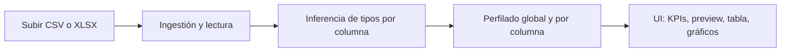

# Paradigm

Aplicación **standalone** en Python para un **análisis inicial automático** sobre tablas cargadas desde archivos CSV o Excel (primera hoja). Está orientada a perfiles de **analista de datos / BI**: exploración rápida, inferencia de tipos de columnas, perfilado básico y visualización en una interfaz web sencilla.

---

## Descripción breve

Paradigm permite subir un dataset, obtener un resumen del volumen y la calidad de los datos (nulos, duplicados, memoria aproximada), revisar un perfil por columna con tipos inferidos y métricas acordes, y una vista previa con gráficos automáticos básicos. El diseño es **agnóstico al dominio** (salud, logística, ventas, deportes, etc.): no asume reglas de negocio de un sector concreto.

---

## Objetivo del proyecto

- Ofrecer una **primera pasada analítica** sobre datos tabulares sin configurar pipelines, bases de datos ni entornos complejos.
- Servir como **base standalone** que en el futuro podría integrarse en otras aplicaciones o evolucionar con nuevas capacidades, manteniendo el foco en la capa de exploración y perfilado de datos.

---

## ¿Qué hace este MVP?

Este repositorio contiene una **primera versión funcional**: una app Streamlit que carga archivos, infiere tipos lógicos de columnas, calcula un perfilado básico y muestra KPIs, tablas y dos gráficos Plotly generados de forma automática según los datos disponibles.

---

## Funcionalidades actuales

| Área | Detalle |
|------|--------|
| **Carga** | Archivos `.csv` y `.xlsx` desde el navegador. |
| **Excel** | Lectura de la **primera hoja** por defecto. |
| **CSV** | Intento de lectura con varios **encodings** comunes y separadores **`,`**, **`;`** y tabulador; elegir el mejor resultado según columnas detectadas. |
| **Inferencia de tipos** | Tipos lógicos: `numeric`, `categorical`, `boolean`, `datetime`, `text`, `id` (heurísticas con límites conocidos). |
| **Perfilado** | Resumen global (filas, columnas, nulos totales, % global, filas duplicadas, memoria aproximada) y detalle por columna (dtype, nulos, % nulos, únicos, cardinalidad, métricas según tipo). |
| **Interfaz** | KPIs, vista previa del dataset, tabla de perfilado, gráfico de nulos por columna y un segundo gráfico (histograma o frecuencias según la primera columna útil). |
| **Ejemplos** | Datasets de muestra en `data/sample/` para pruebas rápidas. |

---

## Stack tecnológico

- **Python** 3.10+
- **Streamlit** — interfaz web
- **Pandas** — manipulación y perfilado tabular
- **Plotly** — gráficos interactivos
- **openpyxl** — lectura de Excel (`.xlsx`)

---

## Estructura del proyecto

```
Paradigm/
├── app/
│   ├── __init__.py
│   ├── main.py              # Punto de entrada Streamlit
│   ├── core/
│   │   ├── __init__.py
│   │   ├── ingestion.py   # Carga CSV/XLSX
│   │   ├── schema.py      # Inferencia de tipos lógicos
│   │   ├── profiling.py   # Perfilado global y por columna
│   │   └── utils.py       # Utilidades compartidas
│   └── visualization/
│       ├── __init__.py
│       └── charts.py      # Figuras Plotly
├── data/
│   └── sample/            # CSV de ejemplo
├── requirements.txt
└── README.md
```

---

## Instalación

```powershell
cd ruta\a\Paradigm
python -m venv .venv
.\.venv\Scripts\Activate.ps1
pip install -r requirements.txt
```

En Linux o macOS:

```bash
cd ruta/a/Paradigm
python3 -m venv .venv
source .venv/bin/activate
pip install -r requirements.txt
```

---

## Cómo ejecutar la app

Desde la **raíz del repositorio** (carpeta `Paradigm`):

```powershell
streamlit run app/main.py
```

Streamlit mostrará una URL local (por defecto `http://localhost:8501`). Abrirla en el navegador.

---

## Cómo probarla con los datasets de ejemplo

1. Ejecutar la app como arriba.
2. En el panel de carga, seleccionar un archivo desde `data/sample/`:
   - `ventas_ejemplo.csv` — columnas con números, fechas y categorías.
   - `mixto.csv` — mezcla de tipos (incluye texto largo y UUIDs de ejemplo).
3. Revisar KPIs, tabla de perfilado, vista previa y gráficos.

---

## Flujo funcional del MVP



1. El usuario sube un archivo.
2. Se lee el contenido en un `DataFrame` (con manejo básico de errores y formatos).
3. Se asignan tipos lógicos por columna.
4. Se calculan métricas de perfilado.
5. Se muestran resumen, tabla detallada y gráficos automáticos.

---

## Limitaciones actuales

- **Una sola hoja** en Excel (la primera); no hay selector de hojas.
- **Inferencia heurística** de tipos: puede equivocarse en columnas ambiguas (p. ej. IDs numéricos, fechas en formatos raros).
- **Rendimiento**: pensado para datasets que caben en memoria en una máquina local; no hay procesamiento distribuido ni streaming.
- **Gráficos**: conjunto fijo y automático; no hay editor de dashboards ni personalización avanzada de gráficos.
- **Sin base de datos**, **sin autenticación** y **sin modelos de Machine Learning** en esta versión.

---

## Próximos pasos (posibles)

Estas líneas son **orientativas** y no forman parte del alcance actual del MVP:

- Refinar heurísticas de tipos y mensajes al usuario.
- Mejoras de UX (selección de hoja en Excel, límites de tamaño de archivo más explícitos).
- Tests automatizados sobre módulos de ingestión y perfilado.
- Evolución futura de la aplicación (p. ej. integración con otros sistemas) sin comprometer el alcance descrito aquí.

No se incluye en el estado actual del repositorio entrenamiento de modelos ni pipelines de ML.

---

## Capturas de pantalla

Para enriquecer el README en GitHub o en un portfolio, se pueden añadir capturas en una carpeta `docs/images/` (crearla si hace falta) y enlazarlas aquí, por ejemplo:

```markdown

```

*(Sustituir por capturas reales cuando estén disponibles.)*

---

## Valor para portfolio (BI / Data Analyst)

Este proyecto muestra de forma práctica:

- **Comprensión del flujo de datos**: de archivo crudo a tabla estructurada.
- **Criterio de calidad de datos**: nulos, duplicados, cardinalidad y tipos inferidos.
- **Comunicación de resultados**: KPIs y visualizaciones en una interfaz accesible.
- **Stack habitual** en analítica y prototipos (Python, Pandas, visualización).

Es un ejemplo concreto de **herramienta de exploración** que puede explicarse en entrevistas técnicas sin sobredimensionar el alcance.

---

## Licencia

**Licencia no especificada aún.** El autor puede definir una licencia abierta (MIT, Apache-2.0, etc.) o restricciones de uso cuando corresponda. Hasta entonces, el uso del código queda bajo la responsabilidad de quien lo clone o modifique.

---

## Contacto / repositorio

Ajustar esta sección con el enlace al repositorio público o perfil profesional cuando se publique el proyecto.
