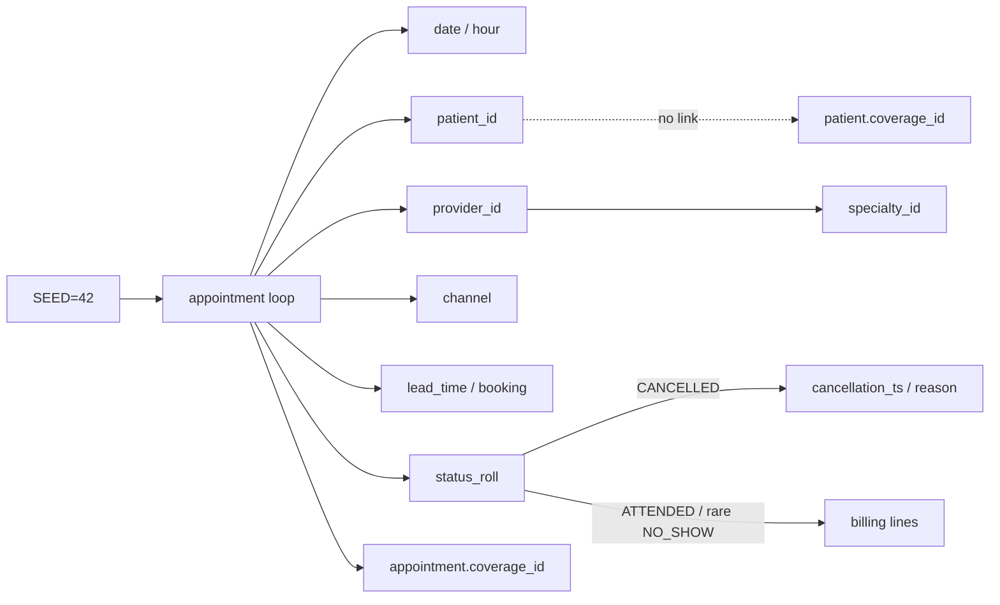

# Auditoría del generador de datos sintéticos (Paradigm v2)

**Alcance:** documentar cómo se generan los CSV en `data/synthetic/`, qué estructura estadística existe y por qué el target de no-show tiene señal predictiva débil.

**Fuentes de código (sin modificar):**

| Rol | Ruta |
|-----|------|
| Generador único | `scripts/generate_paradigm_v2_synthetic.py` |
| Universo ML (ATTENDED ∪ NO_SHOW) | `python/src/paradigm/ml/dataset.py` |
| Features derivadas (post-carga) | `python/src/paradigm/ml/features.py` |

**Metodología de evidencia:** estadísticas calculadas sobre los CSV actuales con un script temporal fuera del repositorio (`%TEMP%`); no se regeneraron datos ni se alteraron hashes SHA-256 de los 11 CSV sintéticos.

**Parámetros globales del generador**

| Parámetro | Valor |
|-----------|--------|
| `SEED` | `42` (`numpy.random.default_rng`) |
| `N_APPOINTMENTS` | `520` |
| Rango calendario | `2024-01-02` … `2025-02-28` |
| Días de cita | solo business days (`pd.bdate_range`) |
| Salida | `data/synthetic/` |

---

## 1. Archivos y funciones responsables

Todo el dataset MVP se construye en `main()` del generador (más `build_dim_date()`). No hay otros scripts de generación de pacientes/turnos/pagos/no-shows.

### Pacientes — `dim_patient.csv`

- **Dónde:** bloque `n_patients = 72` en `main()`.
- **Columnas:** `patient_id` (1…72), `age_band`, `sex`, `coverage_id`.
- **Nota:** el `coverage_id` del paciente **no** se reutiliza en la cita; cada turno muestrea cobertura de nuevo.

### Profesionales — `dim_provider.csv`

- **Dónde:** tabla fija de 8 proveedores con `primary_specialty_id = [1,1,2,3,4,5,6,2]`.
- La especialidad del turno se deriva del proveedor (`specialty_id = primary[prov_id - 1]`), no se muestrea sola.

### Turnos — `fact_appointment.csv`

- **Dónde:** bucle `for i in range(N_APPOINTMENTS)` en `main()`.
- Genera fecha/hora, paciente, proveedor→especialidad, cobertura, canal, lead time / booking, status, cancelación (si aplica).

### Pagos / facturación — `fact_billing_line.csv`

- **Dónde:** mismo bucle, después de decidir `status_roll`.
- Solo (casi) citas ATTENDED; minoría de NO_SHOW con línea PENDING simbólica.

### No-shows

- **No hay tabla aparte.** El outcome es `appointment_status_id ∈ {1,2,3}` (ATTENDED / CANCELLED / NO_SHOW) en `fact_appointment`.
- Dimensión de catálogo: `dim_appointment_status.csv`.

### Variables derivadas (fuera del generador)

Calculadas en el pipeline ML, no persistidas en CSV sintéticos:

| Feature | Función | Momento |
|---------|---------|---------|
| `lead_time_days`, `appointment_hour/dow/month`, `booking_hour` | `add_booking_calendar_features` | post-carga |
| `patient_prior_*`, `provider_prior_*` | `add_historical_features` | post-carga, historial estricto previo |
| `target_no_show` | `load_eligible_appointments` | `status_code == 'NO_SHOW'` |

Dimensiones de apoyo generadas en el mismo script: `dim_date`, `dim_specialty`, `dim_coverage`, `dim_booking_channel`, `dim_billing_status`, `dim_cancellation_reason`.

---

## 2. Semillas, distribuciones y rangos

### Semilla

Una sola: `rng = np.random.default_rng(42)`. Toda la aleatoriedad de filas depende de ella.

### Pacientes (n = 72)

| Campo | Distribución |
|-------|----------------|
| `age_band` | categórica `["18-34","35-54","55-69","70+"]` con `p=[0.28, 0.38, 0.24, 0.10]` |
| `sex` | `["F","M","X"]` con `p=[0.52, 0.46, 0.02]` |
| `coverage_id` | uniforme entero `1…6` |

### Profesionales / especialidades

- 8 proveedores fijos; 6 especialidades fijas (texto).
- Proveedor por cita: uniforme `1…8` → especialidad determinista vía `primary`.

### Turnos

| Variable | Generación |
|----------|------------|
| Fecha | uniforme sobre business days del rango |
| Hora | uniforme `8…17` (enteros); minutos `{0,15,30,45}` |
| Paciente | uniforme `1…72` |
| Cobertura (cita) | uniforme `1…6` (independiente del paciente) |
| Canal | `{WEB, PHONE, RECEPTION}` con `p=[0.35, 0.40, 0.25]` |
| Lead time | `round(Gamma(2.5, 5.0))` clip a `[0, 60]` días |
| Booking | `appointment_start - lead_days`; si cae fin de semana → lunes; hora booking uniforme `9…18` |
| Status | ver §4 |

### Cancelaciones (solo si status = CANCELLED)

- Motivo: uniforme `1…4`.
- 35% “tardías” (0.5–23 h antes); resto uniformes en el intervalo booking→cita (con clamps).

### Facturación

| Condición | Lógica |
|-----------|--------|
| ATTENDED | ~6% sin factura; resto 1–2 líneas (`p=[0.82, 0.18]`), monto `U(6500, 28000)`, status ISSUED/PENDING/PAID `p=[0.42, 0.18, 0.40]`, delay `0…4` días |
| NO_SHOW | ~12% línea PENDING `U(2000, 5000)` el día de la cita |
| CANCELLED | sin facturación |

### Observado en los CSV actuales (n = 520)

| Status | n | proporción |
|--------|---|------------|
| ATTENDED | 368 | 0.708 |
| CANCELLED | 97 | 0.187 |
| NO_SHOW | 55 | 0.106 |

Lead time (universo elegible ATTENDED∪NO_SHOW, n = 423): media ≈ 12.2, std ≈ 8.0, min 0, p50 11, max 51.

---

## 3. Dependencias entre variables



**Dependencias reales en generación**

1. `provider_id` → `specialty_id` (determinista).
2. `appointment_start` + lead → `booking_ts` / `booking_date` (con ajuste de fin de semana).
3. `status_roll == CANCELLED` → campos de cancelación.
4. `status_roll` → presencia/tipo de facturación.

**Independencias explícitas (por diseño del generador)**

- Status **no** depende de lead time, canal, hora, especialidad, edad, sexo, cobertura ni historial.
- Cobertura de la cita **no** depende de la cobertura del paciente.
- Paciente y proveedor se eligen de forma independiente (sin preferencia de “paciente habitual del profesional”).
- No hay estacionalidad programada en tasas de no-show; solo variación muestral por fechas de citas.

Las features `*_prior_*` del modelo **sí** dependen del historial de status, pero ese historial es una secuencia de draws i.i.d. del mismo mecanismo (§4), no de un proceso de riesgo del paciente.

---

## 4. Lógica actual de `no_show`

En el generador, el status se asigna **después** de armar fecha, paciente, proveedor, canal y booking, pero **sin condicionar** a esas variables:

```python
status_weights = np.array([0.70, 0.18, 0.12])  # ATTENDED, CANCELLED, NO_SHOW
status_roll = rng.choice([1, 2, 3], p=status_weights)
```

Implicaciones:

- Entre filas elegibles (excluyendo canceladas), la probabilidad teórica de NO_SHOW es
  \(0.12 / (0.70 + 0.12) \approx 0.146\).
- Observado en datos: **55 / 423 ≈ 0.130** (variación muestral esperable).
- No hay umbral, score latente, ni interacción con covariates.

El label ML es simplemente `target_no_show = 1` si `status_code == "NO_SHOW"` en citas elegibles.

---

## 5. Variables que “deberían” influir pero hoy no lo hacen bien

### Independientes del target (por construcción)

Lead time, canal, hora, DOW/mes, especialidad (vía proveedor), edad, sexo, cobertura de cita, IDs de paciente/proveedor: el generador no las usa al tirar `status_roll`. Cualquier asociación empírica es ruido de muestra finita.

### Aleatorias (sin proceso latente)

Status, paciente, proveedor, canal, cobertura de cita, montos y gaps de billing: draws independientes (salvo la cadena provider→specialty y booking derivado del lead).

### Demasiado débiles (medidas en datos actuales)

| Señal | Evidencia |
|-------|-----------|
| Pearson \|r\| máx. vs target | `appointment_dow` ≈ **0.076**; resto de numéricas del modelo ≤ ~0.06 |
| Mutual information (estimación) | máx. `provider_prior_no_show_count` ≈ **0.029**; `lead_time_days`, hora, DOW, mes, booking_hour, priors de conteo de citas ≈ **0** |
| Segmentos | diferencias de tasa existen (p. ej. lead 0–3 ≈ 22.7% vs 8–14 ≈ 8.3%) pero con n chicos y **sin** mecanismo generador → no son señal estable |

### Generadas después del punto de decisión (post-outcome)

| Campo | Problema |
|-------|----------|
| `cancellation_ts` / `cancellation_reason_id` | solo si CANCELLED; no disponibles para el label binario ATTENDED vs NO_SHOW en el mismo sentido predictivo |
| `fact_billing_line` | condicionado a status (y rare NO_SHOW); **leakage** si se usara como feature |
| Status mismo | es el outcome |

El pipeline ML actual **excluye** facturación y cancelación de las features (correcto para leakage de outcome). Aun así, las features “pre-cita” no tienen estructura causal hacia el target porque el generador no la puso.

---

## 6. Balance del target y segmentación

**Universo elegible:** n = 423, positivos = 55, tasa ≈ **13.0%**.
**Repetición:** 72 pacientes únicos; ~83% de filas son de pacientes con más de una cita elegible.

### Por canal

| Canal | n | tasa no-show |
|-------|---|--------------|
| PHONE | 156 | 0.115 |
| RECEPTION | 110 | 0.118 |
| WEB | 157 | 0.153 |

### Por especialidad

| Especialidad | n | tasa |
|--------------|---|------|
| Cardiología | 105 | 0.190 |
| Clínica médica | 119 | 0.126 |
| Dermatología | 47 | 0.106 |
| Ginecología | 44 | 0.068 |
| Pediatría | 51 | 0.157 |
| Traumatología | 57 | 0.070 |

### Por lead time (bins)

| Bin | n | tasa |
|-----|---|------|
| 0–3 | 44 | 0.227 |
| 4–7 | 92 | 0.109 |
| 8–14 | 157 | 0.083 |
| 15–30 | 118 | 0.169 |
| 31–60 | 12 | 0.167 |

### Por franja horaria

| Hora | n | tasa |
|------|---|------|
| 8–11 | 170 | 0.129 |
| 12–14 | 120 | 0.108 |
| 15–17 | 133 | 0.150 |

### Paciente recurrente vs primera cita (en elegibles)

| | n | tasa |
|--|---|------|
| Primera (en dataset) | 72 | 0.139 |
| Recurrente | 351 | 0.128 |

### Por proveedor (proxy de “historial / agenda”)

Tasas entre ~0.069 y ~0.228 con n≈44–61; compatible con ruido binomial bajo p≈0.13, no con efectos de proveedor diseñados.

### Features del modelo

Las 6 categóricas + 11 numéricas de `features.py` heredan la misma conclusión: **asociaciones marginales débiles / inconsistentes** con un status i.i.d.

---

## 7. Mutual information, correlaciones y señal predictiva

Estimaciones sobre el universo elegible con features alineadas al modelo:

**Pearson (numéricas vs `target_no_show`)** — valores absolutos bajos; el mayor es `appointment_dow` (~0.076). `lead_time_days` ≈ 0.017. Priors de paciente ≈ 0.01 en magnitud.

**Mutual information (sklearn `mutual_info_classif`, semilla fija en el script de auditoría)** — orden de magnitud 0–0.03. Calendario y lead ≈ 0; un poco más en conteos previos de no-show de proveedor/paciente (artefacto de agrupación + muestra pequeña, no de política generadora).

**Interpretación:** bajo un status independiente de X, el AUC poblacional óptimo es ~0.5. Cualquier AUC > 0.5 en hold-out refleja sobreajuste a ruido o variación de split, no estructura recuperable estable. Esto es coherente con auditorías previas de métricas de no-show en el lab.

---

## 8. Revisión de riesgos de datos

### Leakage

| Tipo | Estado |
|------|--------|
| Facturación / status de pago | Condicionado al outcome; **no** entra al modelo actual → riesgo contenido |
| Cancelación | Post-decisión; excluida del feature set |
| Priors | Diseñados sin incluir la fila actual → sin leakage temporal de label de la misma cita |
| Cobertura dual paciente vs cita | Inconsistencia semántica, no leakage de label |

### Drift

No hay cambio de política de status en el tiempo. “Drift” aparente mes a mes (p. ej. tasas mensuales entre ~0.06 y ~0.20) es **variación muestral** con n mensuales ~26–36, no un proceso no estacionario diseñado.

### Estacionalidad

Calendario de citas sí (business days, horas de oficina), pero **tasa de no-show sin estacionalidad programada**. Forecasting de volumen puede tener estructura débil de agenda; forecasting de tasa de no-show no.

### Missingness

- `cancellation_ts` / `cancellation_reason_id`: vacíos en ~81% (todas las no-canceladas) — missingness **estructural por diseño**, no MAR clínico.
- Booking / cobertura de cita: sin missing en fact.
- Pacientes: sin nulos en demografía sintética.

### Anomalías (intencionales / MVP)

- ~6% ATTENDED sin billing; ~12% NO_SHOW con PENDING.
- Cobertura de cita ≠ cobertura del paciente.
- Lead clip 60 + push de booking a días hábiles puede acortar lead efectivo vs el draw gamma.

### Interacciones y no linealidades

El generador **no** define interacciones (p. ej. WEB × lead alto). Un modelo no lineal puede “encontrar” patrones en ruido; no recuperan un mecanismo real porque no existe.

---

## 9. Aleatoriedad realista vs ruido vs ausencia de estructura

| Concepto | En este dataset |
|----------|-----------------|
| **Aleatoriedad realista** | Márgenes demográficos, canales, lead tipo gamma, horarios de oficina, gaps de facturación: útiles para demos de BI / mart |
| **Ruido** | Toda la variación de `status_roll` respecto de covariates; segmentos con tasas distintas por azar |
| **Ausencia de estructura** | Relación X → no-show: **no hay función generadora latente**. El problema de clasificación está mal planteado para “aprender” riesgo |

La distinción clave: el dataset **no** es “difícil porque el mundo es ruidoso”; es “sin señal porque el label se sorteó al margen”.

---

## 10. Limitaciones por tipo de tarea

| Tarea | Limitación principal |
|-------|----------------------|
| **Clasificación (no-show)** | Label independiente de features → techo predictivo ~aleatorio; métricas inestables / no interpretables como “calidad del modelo” |
| **Forecasting** | Series cortas; tasa sin estacionalidad real; volumen sí sigue business days pero es sintético uniforme en días hábiles |
| **Clustering** | Dimensiones demográficas/operativas mezclables, pero clusters no predicen outcome; riesgo de overinterpretar grupos |
| **Causalidad** | No hay interventions, confusores diseñados ni asignaciones; `coverage` inconsistente; status no responde a tratamientos. Inferencia causal **no** está soportada |

---

## Cierre

### Causa principal de la baja capacidad predictiva

El status (incluido NO_SHOW) se muestrea con probabilidades fijas **independientes** de lead time, canal, horario, especialidad, paciente e historial. Las features del modelo describen el contexto de la cita, pero el generador **no** las acopla al label. La señal predictiva es esencialmente ruido de muestra finita.

### Variables candidatas para una futura función generadora

(Sin implementarlas aquí; solo diseño futuro.)

- Lead time (efecto monótono o umbral).
- Canal (p. ej. WEB vs RECEPTION).
- Franja horaria / DOW.
- Especialidad o carga del proveedor.
- Historial latente del paciente (propensión estable + ruido).
- Recordatorio / confirmación (si se modela).
- Distancia temporal a feriados o clima sintético (si se desea estacionalidad).
- Interacciones controladas (lead alto × canal WEB).

### Riesgos de fabricar una señal artificialmente fácil

- AUC/F1 altos que **no** generalizan a datos reales.
- SHAP / importancias que cuentan una historia inventada como si fuera clínica.
- Decisiones simuladas (overbooking, campañas) con ROI falso.
- Tests de “mejora de modelo” que solo miden ajuste a la fórmula plantada.
- Confundir un lab de producto con un paper de predicción clínica.

Recomendación de diseño: señal **moderada y documentada** (p. ej. odds ratios acotados, AUC poblacional objetivo ~0.65–0.75), con ruido residual explícito y semillas fijas — no un clasificador perfecto.

### Tabla resumen

| Variable | Generación actual | Relación con target | Problema | Mejora futura |
|----------|-------------------|---------------------|----------|---------------|
| `appointment_status` / no-show | `choice([1,2,3], p=[0.70,0.18,0.12])` | **Es** el target | Independiente de X | Softmax / score latente f(X)+ε |
| `lead_time_days` | Gamma(2.5, 5) clip [0,60] | Independiente (r≈0.02, MI≈0) | Debería ser predictor fuerte | Subir riesgo con lead alto |
| `booking_channel_id` | Multinomial [0.35,0.40,0.25] | Independiente | Sin efecto de canal | Odds por canal |
| `appointment_hour` / DOW / mes | Uniforme en ventana laboral | Independiente / ruido | Sin estacionalidad de tasa | Efectos horarios/semanales |
| `specialty_id` | Determinista vía proveedor | Solo ruido por muestra | Heterogeneidad aparente no causal | Riesgo por especialidad |
| `provider_id` | Uniforme 1…8 | Independiente | “Efectos” espurios | Random effect de proveedor |
| `patient_id` / demografía | Uniforme + márgenes edad/sexo | Independiente | Paciente sin propensión | Trait latente por paciente |
| `coverage_id` (cita) | Uniforme; ≠ paciente | Independiente | Inconsistencia + sin señal | Alinear a paciente + efecto leve |
| `patient_prior_*` | Derivadas ML de statuses i.i.d. | MI baja / inestable | Historial sin memoria real | Generar propensión persistente |
| `provider_prior_*` | Idem | MI baja | Idem | Carga / mix del proveedor |
| Billing | Post-status | No usada (bien) | Leakage si se usara | Mantener fuera de features predictivas |
| Cancelación | Solo si CANCELLED | Fuera del binario ML | Missing estructural | Modelo multinomial o hazard separado |

---

## Apéndice: integridad

- Hashes SHA-256 de los 11 CSV en `data/synthetic/` verificados **sin cambio** tras esta auditoría (solo documentación).
- Este documento no modifica código, datos ni artefactos de entrenamiento.
- Script de cómputo: temporal fuera del repo; no versionado.
