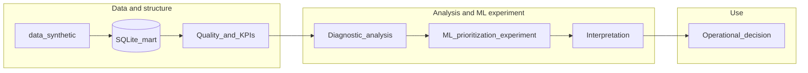
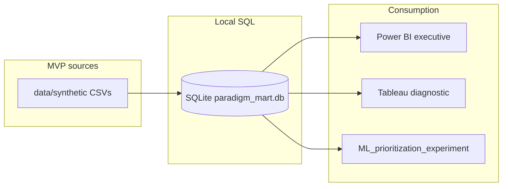

# Paradigm — Architecture

## Overview

Technical flow:

```text
data/synthetic  →  [Python: build mart + quality]  →  SQL mart (DDL + views)
                                                      →  Power BI (executive)
                                                      →  Tableau (diagnostic)
                                                      →  ML prioritization experiment (no-show, same mart)
```

The repository ships **documentation**, **synthetic CSVs** under `data/synthetic/`, and a **local SQLite** mart at `data/processed/paradigm_mart.db` (built by `scripts/build_sqlite_mart.py`; not versioned). DDL and views live in `sql/ddl` and `sql/views`.

## Conceptual analytics architecture

Beyond the technical pipeline, Paradigm follows an analytic value chain:

1. **Governed synthetic data**
2. **Dimensional mart** and KPI-oriented SQL views
3. **Quality** and traceability toward consumption
4. **Executive monitoring** (few signals, period focus)
5. **Diagnostic analysis** (cuts, drivers, exploration)
6. **ML prioritization experiment** (no-show ranking at the documented booking-time decision point)
7. **Interpretation** (feature importances, limits, operational language)
8. **Operational decision** (prioritization, policy review—the repo does **not** automate actions)

This keeps **historical dashboards**, **prioritization**, and **risk** conceptually separate.

## Two lenses on the same operation

| Lens | Documented tool | Role |
|------|-----------------|------|
| **Executive / monitoring** | Power BI (`bi/powerbi/`) | Period KPIs, trend, fast read for leadership: *what happened* |
| **Diagnostic / exploration** | Tableau (`bi/tableau/`) | Cuts, drivers, cause paths: *where to dig* |

Both consume the **same structured truth** (mart + CSV exports). The duplication is **role-based**, not arbitrary tooling overlap.

## Conceptual analytic flow



- **Quality_and_KPIs:** Python validations + SQL views aligned to [`metrics.md`](metrics.md).
- **Diagnostic_analysis:** mainly Tableau + SQL views for segmentation; complements Power BI monitoring.
- **ML_prioritization_experiment:** no-show ranking experiment (`ml/`); methodology-focused, not production prediction.
- **Interpretation:** narrative in [`ml/README.md`](../ml/README.md) and `ml/experiments/metrics.json`.
- **Operational_decision:** outside the repo; the design supports prioritization and review, not automated campaigns.

## Decision-oriented design

Paradigm **enables** decision-oriented reads (policy and automation stay out of code). Trunk questions T1–T6, the matrix mapping question → KPI → SQL → BI → action, concrete use cases UC1–UC5, and the lightweight ML explainability checklist live in [`analytical_questions.md`](analytical_questions.md).

In short: **Power BI** for *what happened* in the period; **Tableau + SQL** for *where to investigate*; **`ml/`** for **prioritization support**, not a substitute for human judgment.

## Dimensional model (summary)

- **Facts:** `fact_appointment` (grain: one appointment), `fact_billing_line` (grain: one billing line).
- **Calendar:** conformed `dim_date`; **role-playing** via `appointment_date`, `booking_date`, `cancellation_date` on facts, and `billing_date` on billing.
- **Dimensions:** patient, provider, specialty (booked service), coverage, appointment status, booking channel, billing status; cancellation reason (optional, MVP-scoped).

Operational specialty for the visit lives on **`fact_appointment`**; `dim_provider` may carry **primary specialty** as a descriptive attribute.

## Synthetic data files (MVP)

| File | Role |
|------|------|
| `dim_date.csv` | Calendar |
| `dim_specialty.csv` | Specialties |
| `dim_coverage.csv` | Coverage / payer labels |
| `dim_appointment_status.csv` | Appointment statuses |
| `dim_booking_channel.csv` | Booking channels |
| `dim_billing_status.csv` | Billing line statuses |
| `dim_cancellation_reason.csv` | Reasons (cancelled only) |
| `dim_patient.csv` | Patients |
| `dim_provider.csv` | Providers |
| `fact_appointment.csv` | Appointments |
| `fact_billing_line.csv` | Billing lines |

Column-level detail: [`data_dictionary.md`](data_dictionary.md).

## Current implementation

- **SQL:** SQLite (see [`sql/README.md`](../sql/README.md)); KPI views in `sql/views/`.
- **Python:** package [`python/src/paradigm/`](../python/README.md) — **quality** (`scripts/run_data_quality.py` → `reports/quality_report.md`), BI exports, **ML** (`scripts/train_no_show.py` → `ml/experiments/`).
- **BI:** CSV from the mart (`export_powerbi_source.py`, `export_tableau_source.py`); designs in [`bi/powerbi/README.md`](../bi/powerbi/README.md) and [`bi/tableau/README.md`](../bi/tableau/README.md). Run quality after `build_sqlite_mart.py`.

## Technical deployment diagram



## Lineage summary

| Stage | Artifact | Role |
|-------|----------|------|
| Source | `data/synthetic/*.csv` | Regenerate with `scripts/generate_paradigm_v2_synthetic.py` |
| Mart | `data/processed/paradigm_mart.db` | DDL, load, views — single analytic truth |
| Quality | `reports/quality_report.md` | Checks on loaded mart |
| BI exports | `bi/powerbi/source_csv/`, `bi/tableau/source_csv/` | Tool-agnostic consumption |
| ML | `ml/experiments/metrics.json`, `.joblib` (ignored) | Same mart as BI |
