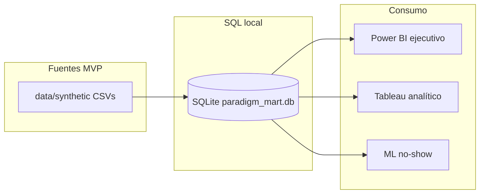

# Paradigm v2 — Arquitectura

## Visión general

Flujo lógico del proyecto (implementación por fases):

```text
data/synthetic  →  [Python: build mart + calidad]  →  SQL mart (DDL + vistas)
                                                      →  Power BI (ejecutivo)
                                                      →  Tableau (analítico)
                                                      →  ML no-show (priorización, mismo mart)
```

Existen **documentación**, **datos sintéticos** en `data/synthetic/` y una **capa SQL local** en SQLite (`data/processed/paradigm_mart.db`, generada con `scripts/build_sqlite_mart.py`, no versionada). El DDL y las vistas viven en `sql/ddl` y `sql/views`.

## Modelo dimensional (resumen)

- **Hechos:** `fact_appointment` (grano: una cita), `fact_billing_line` (grano: una línea de cargo).
- **Calendario:** `dim_date` conformada; **role-playing** en hechos mediante columnas `appointment_date`, `booking_date`, `cancellation_date`, y en facturación `billing_date`.
- **Dimensiones:** paciente, proveedor, especialidad (servicio reservado), cobertura, estado de cita, canal de reserva, estado de facturación; motivo de cancelación (opcional, acotado en MVP).

La especialidad **operativa** del turno vive en **fact_appointment**; `dim_provider` puede incluir **especialidad principal** como atributo descriptivo.

## Archivos de datos sintéticos (MVP)

| Archivo | Rol |
|---------|-----|
| `dim_date.csv` | Calendario |
| `dim_specialty.csv` | Especialidades |
| `dim_coverage.csv` | Coberturas |
| `dim_appointment_status.csv` | Estados de cita |
| `dim_booking_channel.csv` | Canales de reserva |
| `dim_billing_status.csv` | Estados de línea de facturación |
| `dim_cancellation_reason.csv` | Motivos (solo canceladas) |
| `dim_patient.csv` | Pacientes |
| `dim_provider.csv` | Profesionales |
| `fact_appointment.csv` | Citas |
| `fact_billing_line.csv` | Líneas de cargo |

Los detalles de columnas están en [`data_dictionary.md`](data_dictionary.md).

## Estado actual (implementación)

- **SQL:** SQLite (ver [`sql/README.md`](../sql/README.md)); vistas KPI en `sql/views/`.
- **Python:** paquete [`python/src/paradigm/`](../python/README.md) — **calidad** (`scripts/run_data_quality.py` → `reports/quality_report.md`), exports BI, **ML** (`scripts/train_no_show.py` → `ml/experiments/`).
- **BI:** CSV desde el mart (`export_powerbi_source.py`, `export_tableau_source.py`); diseños en [`bi/powerbi/README.md`](../bi/powerbi/README.md) y [`bi/tableau/README.md`](../bi/tableau/README.md). Conviene correr calidad después de `build_sqlite_mart.py`.

## Diagrama conceptual


