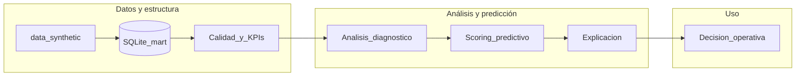
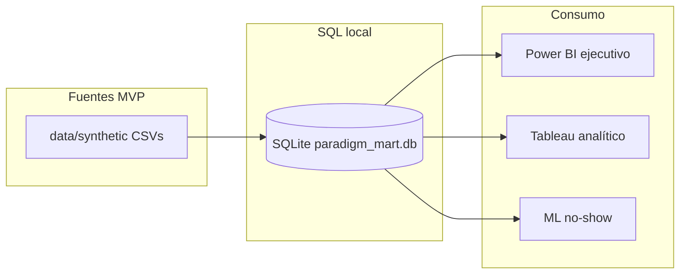

# Paradigm v2 — Arquitectura

## Visión general

Flujo técnico del proyecto:

```text
data/synthetic  →  [Python: build mart + calidad]  →  SQL mart (DDL + vistas)
                                                      →  Power BI (ejecutivo)
                                                      →  Tableau (analítico)
                                                      →  ML no-show (priorización, mismo mart)
```

Existen **documentación**, **datos sintéticos** en `data/synthetic/` y una **capa SQL local** en SQLite (`data/processed/paradigm_mart.db`, generada con `scripts/build_sqlite_mart.py`, no versionada). El DDL y las vistas viven en `sql/ddl` y `sql/views`.

## Arquitectura analítica (conceptual)

Además del flujo técnico, Paradigm se organiza como cadena de valor analítica:

1. **Datos** sintéticos gobernados  
2. **Estructura / mart** dimensional y vistas KPI  
3. **Calidad** y trazabilidad hacia consumo  
4. **Monitoreo ejecutivo** (pocas señales, periodo)  
5. **Análisis diagnóstico** (cortes, causa, exploración)  
6. **Scoring predictivo** (riesgo de no-show en el punto de decisión documentado)  
7. **Interpretación** (importancias, limitaciones, lectura en lenguaje operativo)  
8. **Decisión** operativa (priorización, revisión de reglas; el repo no automatiza acciones)

Así se conectan **datos** e **inteligencia operativa aplicada** sin confundir el tablero histórico con la priorización ni el riesgo.

## Dos lentes sobre la misma operación

| Lente | Herramienta documentada | Función |
|--------|-------------------------|---------|
| **Vista ejecutiva / monitoreo** | Power BI (`bi/powerbi/`) | KPIs del periodo, tendencia, lectura rápida para dirección: *qué pasa* |
| **Vista analítica / diagnóstico** | Tableau (`bi/tableau/`) | Cortes, exploración y lectura de causa: *dónde profundizar* |

Ambas consumen la **misma verdad estructurada** (mart + exportes CSV). No es duplicación arbitraria de herramientas: son **roles distintos** frente a la misma operación.

## Diagrama conceptual (flujo analítico)



- **Calidad_y_KPIs:** validaciones Python + vistas SQL alineadas a definiciones.  
- **Analisis_diagnostico:** principalmente Tableau + vistas para cortes; complementa al monitoreo Power BI.  
- **Scoring_predictivo:** modelo de no-show (`ml/`).  
- **Explicacion:** importancias y narrativa en `ml/README.md` y métricas en `metrics.json`.  
- **Decision_operativa:** fuera del repo; el diseño habilita *priorizar* y *revisar*, no ejecuta campañas.

## Casos de decisión

El diseño de Paradigm **habilita** lecturas orientadas a decisión (políticas y automatización quedan fuera del código). Las **preguntas troncales** (T1–T6), la **matriz** pregunta → KPI → SQL → BI → posible acción, los **casos concretos** (UC1–UC5) y la **plantilla de explicabilidad** del modelo de no-show están en [`analytical_questions.md`](analytical_questions.md).

En síntesis: **monitoreo ejecutivo** (Power BI) para *qué pasa* en el periodo; **diagnóstico por cortes** (Tableau, vistas SQL) para *dónde profundizar*; **riesgo de no-show** (`ml/`) como apoyo a **priorización**, no sustituto del criterio humano.

## Modelo dimensional (resumen)

- **Hechos:** `fact_appointment` (grano: una cita), `fact_billing_line` (grano: una línea de cargo).
- **Calendario:** `dim_date` conformada; **role-playing** en hechos mediante columnas `appointment_date`, `booking_date`, `cancellation_date`, y en facturación `billing_date`.
- **Dimensiones:** paciente, proveedor, especialidad (servicio reservado), cobertura, estado de cita, canal de reserva, estado de facturación; motivo de cancelación (opcional, acotado en MVP).

La especialidad **operativa** del turno vive en **fact_appointment**; `dim_provider` puede incluir **especialidad principal** como atributo descriptivo.

## Archivos de datos sintéticos (MVP)

| Archivo | Rol |
|---------|-----|
| `dim_date.csv` | Calendario |
| `dim_specialty.csv` | Especialidades |
| `dim_coverage.csv` | Coberturas |
| `dim_appointment_status.csv` | Estados de cita |
| `dim_booking_channel.csv` | Canales de reserva |
| `dim_billing_status.csv` | Estados de línea de facturación |
| `dim_cancellation_reason.csv` | Motivos (solo canceladas) |
| `dim_patient.csv` | Pacientes |
| `dim_provider.csv` | Profesionales |
| `fact_appointment.csv` | Citas |
| `fact_billing_line.csv` | Líneas de cargo |

Los detalles de columnas están en [`data_dictionary.md`](data_dictionary.md).

## Estado actual (implementación)

- **SQL:** SQLite (ver [`sql/README.md`](../sql/README.md)); vistas KPI en `sql/views/`.
- **Python:** paquete [`python/src/paradigm/`](../python/README.md) — **calidad** (`scripts/run_data_quality.py` → `reports/quality_report.md`), exports BI, **ML** (`scripts/train_no_show.py` → `ml/experiments/`).
- **BI:** CSV desde el mart (`export_powerbi_source.py`, `export_tableau_source.py`); diseños en [`bi/powerbi/README.md`](../bi/powerbi/README.md) y [`bi/tableau/README.md`](../bi/tableau/README.md). Conviene correr calidad después de `build_sqlite_mart.py`.

## Diagrama de despliegue técnico (referencia)


