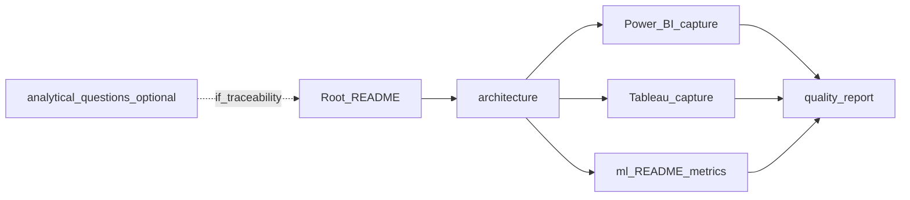

# Paradigm — Portfolio evidence and presentation

What to show on GitHub or in an interview, aligned with **analytics engineering** positioning (not “charts only”). The **executive** screenshot lives under **`assets/dashboards/`** (canonical). Optional Tableau captures under `assets/bi/` remain optional until exported; the repo stays coherent without new binary images.

---

## Evidence checklist

Before a demo or interview:

- [ ] Pipeline run at least through mart + quality: `build_sqlite_mart.py`, `run_data_quality.py` (and BI exports if opening Desktop).
- [ ] [`reports/quality_report.md`](../reports/quality_report.md) present or regenerated.
- [ ] [`ml/experiments/metrics.json`](../ml/experiments/metrics.json) matches last training if you open it (**reproducibility / evaluation plumbing**—not a synthetic performance trophy).
- [ ] Know which image you use for the executive view: canonical [`assets/dashboards/powerbi_executive.png`](../assets/dashboards/powerbi_executive.png).
- [ ] Know the **1 → 2 → 3** reveal order below.

---

## Dashboard screenshot convention

| Location | Role |
|----------|------|
| [`assets/dashboards/powerbi_executive.png`](../assets/dashboards/powerbi_executive.png) | **Canonical** executive snapshot referenced from the root [`README.md`](../README.md). |

In demo, show **one** executive view first (order below).

**Tableau (optional):** when exported, use `assets/bi/tableau_analytics.png` ([`assets/README.md`](../assets/README.md)).

---

## Suggested reveal order (demo or README story)

1. **Executive (Power BI)** — “what happened in the period” in a few KPIs (`assets/dashboards/powerbi_executive.png`).
2. **Diagnostic (Tableau)** — cuts and drivers; second lens (`tableau_analytics.png` when it exists).
3. **Technical backup** — [`reports/quality_report.md`](../reports/quality_report.md); if ML comes up, lead with [`ml/README.md`](../ml/README.md) (framing, leakage, split)—use `metrics.json` only to show **how** evaluation is wired, not to headline AUC.

If `assets/bi/` has no Tableau capture yet, the README still shows the executive image from `assets/dashboards/`; describe Tableau using [`bi/tableau/README.md`](../bi/tableau/README.md) without inventing a screenshot.

---

## Regenerable reports

| Artifact | Path | Notes |
|----------|------|------|
| Mart quality report | [`reports/quality_report.md`](../reports/quality_report.md) | Run `python scripts/run_data_quality.py` after build |
| ML metrics | [`ml/experiments/metrics.json`](../ml/experiments/metrics.json) | Run `python scripts/train_no_show.py`; do not treat scores as business success on synthetic data |

---

## Optional captures (`assets/bi/`)

For **Tableau** only (executive Power BI image is canonical under `assets/dashboards/`). Place **PNG or WebP** per [`assets/README.md`](../assets/README.md):

| View | File | Minimum content |
|------|------|-----------------|
| Tableau — diagnostic | `tableau_analytics.png` | E.g. heatmap or driver view; consistent with [`bi/tableau/README.md`](../bi/tableau/README.md) |

---

## Walkthrough structure

From general to specific: landing README → architecture → (optional) [`analytical_questions.md`](analytical_questions.md) if traceability is requested → BI layers → ML → regenerable evidence.

## Presenting the ML layer (portfolio-safe)

When you reach ML in a demo, **methodology is the star**, not ROC-AUC.

- **Problem framing** — Booking-time target, eligible appointment universe, explicit “what this is not” (e.g. cancellation is a different label).
- **Leakage discipline** — Only features knowable at the decision point; history strictly before the current appointment.
- **Temporal split** — By appointment date (not random rows), so the read is closer to deployment reality than a shuffled split.
- **Why weak metrics are disclosed** — Synthetic ROC-AUC near or below 0.5 is **expected to be possible**; hiding it would mislead. It reflects weak generator signal and portfolio honesty, not a secret bug.
- **How it improves with real data** — Real histories, richer segments, monitoring, calibration, and organizational validation—none of which synthetic data can substitute for.

Optional glance at [`ml/experiments/metrics.json`](../ml/experiments/metrics.json): **split definition**, ranking-style fields, importances—**not** “winning” scores on synthetic data.

---

## Demo scripts

### 60–90 seconds

1. **Problem** — Outpatient friction (no-shows, cancels, billing misalignment); metrics must be governed.
2. **What you built** — Synthetic dimensional data → SQLite mart → quality → BI exports (two lenses) → scoped ML experiment.
3. **Proof** — One architecture sentence or diagram reference; one KPI definition cite [`metrics.md`](metrics.md); executive screenshot or README.
4. **ML** — **Methodology story** (target, leakage, temporal split, honest metrics); [`ml/README.md`](../ml/README.md) first—never treat synthetic AUC as the headline win.
5. **Close** — Synthetic data; no production deployment.

### ~5 minutes

Cover steps **1–2**, **4**, **7**, **8** from the detailed table below (problem, reproducible chain, metrics snippet, executive capture, quality excerpt, ML framing, limitations).

### Detailed demo steps (~12–15 minutes)

| Step | One-line message | What to show | Approx. time |
|------|------------------|--------------|--------------|
| 1 | The issue is operational metrics, not “more charts.” | README Problem/Solution or [`problem.md`](problem.md) summary | 1 min |
| 2 | The repo has a reproducible chain from data to consumption. | README Architecture or [`architecture.md`](architecture.md) | 1 min |
| 3 | Metrics are defined and auditable. | Snippet from [`metrics.md`](metrics.md) (one KPI with numerator/denominator) | 1 min |
| 4 | Period status at a glance (executive). | [`assets/dashboards/powerbi_executive.png`](../assets/dashboards/powerbi_executive.png) | 1–2 min |
| 5 | Diagnostic is a different role: cuts and drivers. | Tableau capture or [`bi/tableau/README.md`](../bi/tableau/README.md) | 1–2 min |
| 6 | Mart quality is verifiable. | [`reports/quality_report.md`](../reports/quality_report.md) excerpt | 1 min |
| 7 | ML is a **documented prioritization experiment**: same mart as BI; **how** the label and features are defined matters more than synthetic AUC. | [`ml/README.md`](../ml/README.md) (lead); optional `metrics.json` only for split / plumbing / importances—**disclose** weak synthetic performance | 2 min |
| 8 | Close with honesty: synthetic, not production. | Same themes as README Limitations | 1 min |

**Shortcut:** if asked “which business question maps where?” — open [`analytical_questions.md`](analytical_questions.md) (T1–T6 or matrix).

### Pitch levels (concise)

- **Short (30–45 s)** — Reproducible outpatient analytics case: SQL mart, documented KPIs, Python quality, Power BI + Tableau as two lenses, scoped no-show experiment with honest evaluation. Data synthetic; focus on method.
- **Medium (2–3 min)** — Expand: problem (schedule, alignment, auditability); build (SQLite mart, metrics dictionary, quality, two BI roles); demo order (monitoring → diagnostic → ML as prioritization); close with synthetic disclaimer.

### Technical defense (~8–10 min)

Cover: dimensional model and SQL as KPI contract; quality validation and regenerable report; two BI tools / same source / different roles; ML **framing** (target, allowed features vs leakage, temporal split, evaluation)—and **why** weak synthetic metrics are stated openly; limitations (synthetic, no production ML service, finance MVP bounds).

### Implementation evidence (if asked)

1. Root README or architecture slide.
2. [`metrics.md`](metrics.md) or screenshot: numerator, denominator, anchoring.
3. [`reports/quality_report.md`](../reports/quality_report.md) fragment.
4. Power BI: capture or local `.pbix`; repo has CSV + DAX + instructions.
5. Tableau: diagnostic capture.
6. ML: [`ml/README.md`](../ml/README.md) (primary); `metrics.json` as artifact-of-process if asked (not as proof of strong predictive performance).

---

## Draft external copy (placeholders — refine for your voice)

Use these as **starting points**, not final marketing.

| Channel | Draft placeholder |
|---------|-------------------|
| **GitHub repo description** | Synthetic outpatient analytics portfolio: SQLite mart, governed KPIs, Power BI + Tableau exports, reproducible Python pipeline, scoped ML prioritization experiment. |
| **LinkedIn project blurb** | End-to-end demo of dimensional modeling and metric governance for outpatient operations: reproducible mart, BI-ready exports, quality checks, and an honest ML prioritization layer on synthetic data—focused on methodology, not fake clinical claims. |
| **CV bullet** | Built a reproducible synthetic healthcare analytics portfolio (SQLite mart, governed KPIs, dual BI lens documentation, Python QC pipeline, scoped no-show prioritization experiment with temporal validation and leakage controls). |
| **Short demo pitch** | “Paradigm is a portfolio case study: one governed mart feeding executive and diagnostic BI plus a small ML experiment framed for prioritization—not production prediction—all on synthetic data to show how I define metrics, validate them, and document limits.” |

---

## Limitations to state clearly

- Numbers are **not** real; any figure is illustrative.
- `.pbix` / `.twbx` are **not** the repo contract by default; deliverable is **material + documentation**.
- ML may be **weak on synthetic data**; what you defend is problem framing, features, and evaluation design.
- **Occupancy proxy** and strict **cash collected** are limited or out of MVP per [`metrics.md`](metrics.md).

---

## FAQ

- **Why two BI tools?** Same mart, **two roles**: executive monitoring vs diagnostic exploration.
- **How do you validate KPIs?** Executive validation script + metrics dictionary + mart quality checks.
- **Is ML in production?** No—a documented prioritization experiment only.
