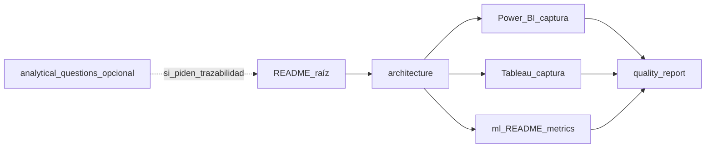

# Cómo presentar Paradigm v2 (demo / entrevista)

Guía para contar el proyecto como **demo de inteligencia operativa aplicada**: recorrido de negocio primero, defensa técnica después. Las herramientas y rutas de archivos van al **final** como apoyo.

Si la audiencia pide **trazabilidad pregunta → KPI → artefacto**, remitir a [`analytical_questions.md`](analytical_questions.md) (preguntas T1–T6); no repetir aquí esa matriz.

**Orden y rutas de capturas:** [`portfolio_evidence.md`](portfolio_evidence.md).

---

## 1. Recorrido narrativo (eje principal)

Seguí este orden al presentar:

1. **Contexto del problema** — ausencias, cancelaciones, saturación o desalineación atención–facturación; por qué hace falta definición de métricas y modelo trazable.
2. **Datos y estructura** — dataset sintético dimensional, mart SQLite, DDL/vistas, calidad; datos ficticios con propósito metodológico.
3. **Estado operativo actual (capa descriptiva)** — KPIs del periodo, tendencia; idealmente una captura del **tablero ejecutivo** (Power BI) o el README.
4. **Diagnóstico (capa diagnóstica)** — cortes por especialidad, canal, tiempo; vista analítica (Tableau) como **segundo lente**, no duplicado del ejecutivo.
5. **Predicción (capa predictiva acotada)** — riesgo de no-show: *qué* se estima, *en qué momento* se scorea, *para qué* (priorización), sin vender AUC en sintético.
6. **Explicación** — importancias de modelo, limitaciones, por qué no es caja negra aislada del análisis.
7. **Decisión o acción sugerida** — qué haría una operación con esto: recordatorios focalizados, revisión de franjas o reglas de agenda; honestidad sobre que aquí no hay “producción”.

Si el tiempo aprieta: **1 → 2 → 3 → 5** y cerrá con limitaciones.

---

## 2. Guion de demo (paso a paso)

Usá esta secuencia en **demo en vivo** o **grabación**; los tiempos son orientativos para un recorrido de **~12–15 minutos**. Para **~5 minutos**, hacé solo pasos 1–2, 4, 7 y 8.

| Paso | Mensaje (una frase) | Qué mostrar | Tiempo orientativo |
|------|---------------------|-------------|-------------------|
| 1 | El problema es operativo y de métricas, no “más gráficos”. | README: secciones **1–3** o [`business_case.md`](business_case.md) (resumen). | 1 min |
| 2 | El repo tiene una cadena reproducible de datos a consumo. | README: **4** (diagrama) o [`architecture.md`](architecture.md) (diagrama + dos lentes). | 1 min |
| 3 | Las métricas están definidas y auditables. | Fragmento de [`metric_definitions.md`](metric_definitions.md) (un KPI con numerador/denominador). | 1 min |
| 4 | El estado del periodo se ve en un solo vistazo (ejecutivo). | Captura Power BI: [`public/img/Dashboard_ejecutivo.png`](../public/img/Dashboard_ejecutivo.png) en README o equivalente en [`assets/bi/`](../assets/README.md) — ver [`portfolio_evidence.md`](portfolio_evidence.md). | 1–2 min |
| 5 | El diagnóstico es otro rol: cortes y causa, no repetir el ejecutivo. | Captura Tableau o CSV/historia descrita en [`bi/tableau/README.md`](../bi/tableau/README.md). | 1–2 min |
| 6 | La calidad del mart es verificable. | [`reports/quality_report.md`](../reports/quality_report.md) (extracto). | 1 min |
| 7 | El ML prioriza; no reemplaza al negocio ni al BI descriptivo. | [`ml/README.md`](../ml/README.md) (punto de decisión) + `ml/experiments/metrics.json` (split, métricas, importancias; **no** el puntaje como “éxito”). | 2 min |
| 8 | Cierro con honestidad: sintético, sin producción. | Misma lista que **Limitaciones** más abajo o en sección 3 de este doc. | 1 min |

**Atajo si preguntan “¿qué pregunta de negocio responde cada cosa?”** — Abrir solo [`analytical_questions.md`](analytical_questions.md) (tabla T1–T6 o matriz).

---

## 3. Recorrido visual del proyecto

De lo **general** a lo **particular**: landing → arquitectura → (opcional) marco de preguntas → capas BI → ML → evidencia regenerable.

---

## 4. Tres niveles de discurso

### Pitch corto (30–45 segundos)

> Paradigm es una **demo reproducible de inteligencia operativa aplicada** con caso en **salud ambulatoria**: mart en SQL, métricas documentadas, calidad en Python, **dos lentes** de BI — Power BI para monitoreo ejecutivo y Tableau para diagnóstico — y un modelo de **riesgo de no-show** como **capa predictiva complementaria** con punto de decisión y evaluación honesta. Los datos son sintéticos; el foco es **criterio analítico y narrativa defendible**, no fingir resultados de un hospital real.

### Pitch medio (2–3 minutos)

Expandí el pitch corto sin abrir aún todos los archivos:

1. **Problema:** agenda, ausentismo, facturación desalineada; sin definiciones de KPIs el tablero no es auditable.
2. **Qué construí:** mart en SQLite, diccionario de métricas, calidad, exportes a dos herramientas de BI con roles distintos.
3. **Qué muestra la demo:** primero **monitoreo** (pocas señales), después **diagnóstico por cortes**; el ML es **priorización** con límites claros, no producto.
4. **Cierre:** datos ficticios; valor = método y narrativa, no cifras “reales”.

**Frase puente hacia demo con pantalla:** “Si te parece, en dos minutos recorro el README y una captura de cada capa.”

### Recorrido guiado con pantalla (3–5 minutos)

Recorrido **1–7** de la sección 1, mostrando en pantalla como mucho: README o diagrama de [`docs/architecture.md`](architecture.md), un fragmento de [`docs/metric_definitions.md`](metric_definitions.md) o calidad, captura o mención de BI, y [`ml/README.md`](ml/README.md) + `metrics.json` con énfasis en **split temporal** y **leakage**, no en el puntaje.

**Frase puente hacia defensa técnica:** “Si querés bajar a implementación, te muestro SQL, validación y decisiones de diseño.”

### Defensa técnica (8–10 minutos)

Profundizar en:

- **Modelo dimensional** y contrato SQL como fuente de verdad para KPIs.
- **Validación de calidad** y reporte regenerable.
- **Dos herramientas de BI:** misma fuente, roles distintos (monitoreo vs causa).
- **ML:** definición del target, features permitidas vs leakage, split temporal, métricas de ranking y utilidad operativa conceptual (p. ej. captura en decil alto).
- **Limitaciones:** sintético, sin servicio en producción, métricas financieras acotadas en MVP.

---

## 5. Apoyo técnico (anexo)

### Qué mostrar si piden evidencia de implementación

1. **README del repo** o una slide con el diagrama de arquitectura.
2. **`docs/metric_definitions.md`** o una captura: numerador, denominador y anclaje temporal.
3. **`reports/quality_report.md`** (o fragmento): trazabilidad entre datos cargados y listos para consumir.
4. **Power BI** (captura o `.pbix` local): una pantalla ejecutiva; el repo trae CSV + DAX + instrucciones.
5. **Tableau** (captura): una vista analítica distinta (exploración / causa).
6. **ML** (`ml/README.md` + `metrics.json`): punto de decisión, split temporal y leakage.

### Decisiones técnicas a defender

| Decisión | Por qué |
|----------|---------|
| **SQLite** para el mart | Portabilidad, un archivo, suficiente para MVP y portfolio. |
| **KPIs en documento + SQL** | Los tableros heredan definiciones; se evita “cada visual con su fórmula”. |
| **Power BI vs Tableau** | Monitoreo ejecutivo vs análisis diagnóstico; mismo mart, funciones distintas. |
| **Split temporal en ML** | Evita mezclar futuro y pasado en validación. |
| **Datos sintéticos** | Ética y claridad; el valor es el **método**, no una predicción productiva. |

### Limitaciones a mencionar con honestidad

- Los datos **no** son reales; cualquier cifra es **ilustrativa**.
- Los **.pbix / .twbx** no están versionados como binarios por defecto; el entregable es **material + documentación**.
- El **ML** puede tener **bajo poder predictivo** en sintético; lo defendible es la **definición del problema, features y evaluación**.
- **Ocupación** e **ingreso cobrado** estricto están **acotados o fuera** del MVP según `metric_definitions.md`.

### Preguntas frecuentes

- **¿Por qué dos herramientas de BI?** Misma fuente, **dos lentes**: ejecutivo vs diagnóstico.
- **¿Cómo validás KPIs?** Script de validación ejecutiva + diccionario + calidad en el mart.
- **¿El modelo ML está en producción?** No; es **capa de demostración** y priorización conceptual.
